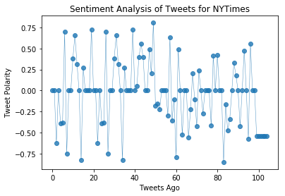
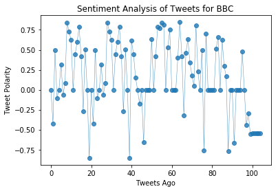
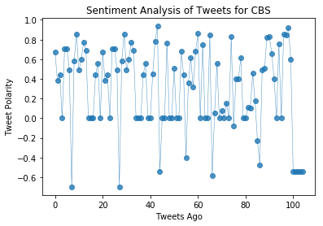
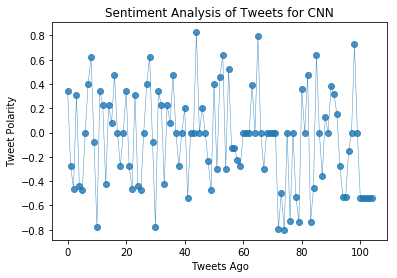
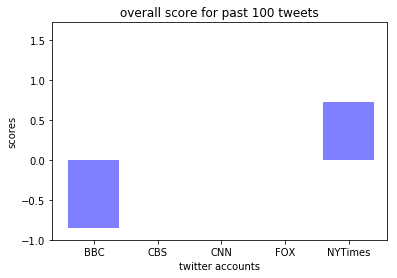

## News Mood

In this assignment, you'll create a Python script to perform a sentiment analysis of the Twitter activity of various news oulets, and to present your findings visually.

Your final output should provide a visualized summary of the sentiments expressed in Tweets sent out by the following news organizations: __BBC, CBS, CNN, Fox, and New York times__.




The first plot will be and/or feature the following:

* Be a scatter plot of sentiments of the last __100__ tweets sent out by each news organization, ranging from -1.0 to 1.0, where a score of 0 expresses a neutral sentiment, -1 the most negative sentiment possible, and +1 the most positive sentiment possible.
* Each plot point will reflect the _compound_ sentiment of a tweet.
* Sort each plot point by its relative timestamp.

The second plot will be a bar plot visualizing the _overall_ sentiments of the last 100 tweets from each organization. For this plot, you will again aggregate the compound sentiments analyzed by VADER.

The tools of the trade you will need for your task as a data analyst include the following: tweepy, pandas, matplotlib, seaborn, textblob, and VADER.

Your final Jupyter notebook must:

* Pull last 100 tweets from each outlet.
* Perform a sentiment analysis with the compound, positive, neutral, and negative scoring for each tweet. 
* Pull into a DataFrame the tweet's source acount, its text, its date, and its compound, positive, neutral, and negative sentiment scores.
* Export the data in the DataFrame into a CSV file.
* Save PNG images for each plot.

As final considerations:

* Use the Matplotlib and Seaborn libraries.
* Include a written description of three observable trends based on the data. 
* Include proper labeling of your plots, including plot titles (with date of analysis) and axes labels.
* Include an exported markdown version of your Notebook called  `README.md` in your GitHub repository.  


```python
import tweepy
import json
import numpy as np
from datetime import datetime
import matplotlib.pyplot as plt
from vaderSentiment.vaderSentiment import SentimentIntensityAnalyzer
analyzer = SentimentIntensityAnalyzer()
import pandas as pd
import seaborn as sns
from textblob import TextBlob
from pprint import pprint

consumer_key = "IM0MM9EIYEznGPI8dwzvRdJor"
consumer_secret = "Eal8dLME44hmfVhRn04GZOJyAjPKbh1d8mUc20gyJIvVCDgIPD"
access_token = "969400511928479744-CeLxAAwtNY55VPZCctXwx7ODuNcsLcG"
access_token_secret = "jIprrB3mLX2Q64KqkxqOvi0Arvw9RR8ESWPU1UxlZWIZY"

# Setup Tweepy API Authentication
auth = tweepy.OAuthHandler(consumer_key, consumer_secret)
auth.set_access_token(access_token, access_token_secret)
api = tweepy.API(auth, parser=tweepy.parsers.JSONParser())


```


```python
#create a list for all target user accounts
target_users = ["@BBC", "@CBS", "@CNN", "@Fox", "@nytimes"]
compound_list = []
positive_list = []
negative_list = []
neutral_list = []
sentiments = []

for users in target_users:
    for x in range(5):
        all_tweets = api.user_timeline(users, page=x)
        for tweet in all_tweets:
            #tweet_times = []
            tweet_text = tweet["text"].lower()
            #tweet_times.append(tweet["created_at"])
            #tweet_time_objects = []
            #for x in range(len(tweet_times)):
                #tweet_datetime = datetime.strptime(tweet_times[x], "%a %b %d %H:%M:%S %z %Y")
                #tweet_time_objects.append(tweet_datetime)
                # Run Vader Analysis on each tweet
            results = analyzer.polarity_scores(tweet_text)
            compound = results["compound"]
            pos = results["pos"]
            neu = results["neu"]
            neg = results["neg"]
            #print scores for each tweet, all 100 tweets            
            print(f"User: {users}")
            print(tweet_text)
            print("Compound Score:", compound)
            print("Positive Score:", pos)
            print("Neutral Score:", neu)
            print("Negative Score: ", neg)
            print()
            sentiments.append({"User": users,
                               "Compound": compound,
                                "Positive": pos,
                                "Negative": neg,
                                "Neutral": neu,
                                "Tweet Count": len(compound_list)
                                })
    sentiments_df = pd.DataFrame.from_dict(sentiments)
    sentiments_df.head(20)     
```

    User: @BBC
    😂🙊 who has a filthier mouth, jennifer lawrence or james mcavoy? https://t.co/lofgchvo6r
    Compound Score: 0.0
    Positive Score: 0.0
    Neutral Score: 1.0
    Negative Score:  0.0
    
    User: @BBC
    a diver swims through a thick soup of plastic waste near bali.
    https://t.co/w8gjnkq8rm
    Compound Score: -0.4215
    Positive Score: 0.0
    Neutral Score: 0.781
    Negative Score:  0.219
    
    User: @BBC
    every day around the uk, an army of unpaid volunteers put their lives on the line to try and save complete stranger… https://t.co/w3fel1ipsk
    Compound Score: 0.4939
    Positive Score: 0.127
    Neutral Score: 0.873
    Negative Score:  0.0
    
    User: @BBC
    impressive and terrifying in equal measure. 
    
    this woman doesn't just sleepwalk... she sleep-drives too. https://t.co/ovwb4dnayj
    Compound Score: -0.1027
    Positive Score: 0.165
    Neutral Score: 0.65
    Negative Score:  0.185
    
    User: @BBC
    rt @bbcwritersroom: new #brexit #comedy soft border patrol is set on the border between #northernireland and the republic of #ireland. we p…
    Compound Score: 0.0
    Positive Score: 0.0
    Neutral Score: 1.0
    Negative Score:  0.0
    
    User: @BBC
    🐧 scientists have stumbled across a huge group of previously unknown adélie penguins on the most northerly point of… https://t.co/3gq8plqymy
    Compound Score: 0.3182
    Positive Score: 0.119
    Neutral Score: 0.881
    Negative Score:  0.0
    
    User: @BBC
    too many lego bricks is a problem many parents will sympathise with, but now the toy firm itself has admitted it ha… https://t.co/4j0whitwan
    Compound Score: -0.0644
    Positive Score: 0.068
    Neutral Score: 0.853
    Negative Score:  0.079
    
    User: @BBC
    rt @bbccomedy: nothing says welcome to the neighbourhood quite like everyone's favourite busybody 😂#twodoorsdown https://t.co/dclrm13dm9
    Compound Score: 0.0806
    Positive Score: 0.153
    Neutral Score: 0.711
    Negative Score:  0.136
    
    User: @BBC
    🍻 cheers to that! 
    
    pubs will be allowed to stay open later than usual to give everyone a chance to celebrate princ… https://t.co/k7tounowsg
    Compound Score: 0.8439
    Positive Score: 0.336
    Neutral Score: 0.664
    Negative Score:  0.0
    
    User: @BBC
    tickets, food wrappers and posters provide a fascinating insight into the creativity of north korea, and the image… https://t.co/oe4tzwlbjw
    Compound Score: 0.7269
    Positive Score: 0.276
    Neutral Score: 0.724
    Negative Score:  0.0
    
    User: @BBC
    rt @bbcthree: no you can't cure depression with meditation, kale or by simply cheering up. https://t.co/gsm8lrx6n2
    Compound Score: 0.6246
    Positive Score: 0.293
    Neutral Score: 0.605
    Negative Score:  0.102
    
    User: @BBC
    rt @bbcscotlandnews: a giant three-dimensional concrete map of scotland is to be officially unveiled next month in the borders https://t.co…
    Compound Score: 0.0
    Positive Score: 0.0
    Neutral Score: 1.0
    Negative Score:  0.0
    
    User: @BBC
    👟♻️ british designer anna bullus is on a mission to recycle chewing gum into useful objects, cleaning up our street… https://t.co/wbbejsxxqf
    Compound Score: 0.4404
    Positive Score: 0.132
    Neutral Score: 0.868
    Negative Score:  0.0
    
    User: @BBC
    what happened to the beautiful opal reef that was one of the stars of david attenborough's #blueplanet2? https://t.co/rmnyfrbbdk
    Compound Score: 0.5994
    Positive Score: 0.187
    Neutral Score: 0.813
    Negative Score:  0.0
    
    User: @BBC
    rt @bbcsportwales: we could watch this all day! 
    
    welcome to the wonderful world of football analogies - starring @swansofficial manager ca…
    Compound Score: 0.7901
    Positive Score: 0.28
    Neutral Score: 0.72
    Negative Score:  0.0
    
    User: @BBC
    🐒❤️ this baby chimp is being flown to a new home in dr congo after it was rescued from poachers. https://t.co/ruzzdvlbt8
    Compound Score: 0.4215
    Positive Score: 0.128
    Neutral Score: 0.872
    Negative Score:  0.0
    
    User: @BBC
    💍🙅 crippling costs and parents' split-ups could be to blame for the declining number of marriages between men and w… https://t.co/avvwngx3jh
    Compound Score: -0.2732
    Positive Score: 0.057
    Neutral Score: 0.837
    Negative Score:  0.106
    
    User: @BBC
    we've all heard thunder before, but what does lightning sound like? ⚡️🤔https://t.co/3bgkk7iukq
    Compound Score: 0.5023
    Positive Score: 0.228
    Neutral Score: 0.772
    Negative Score:  0.0
    
    User: @BBC
    😂 who actually watched the #oscars? https://t.co/opthfzy37n
    Compound Score: 0.0
    Positive Score: 0.0
    Neutral Score: 1.0
    Negative Score:  0.0
    
    User: @BBC
    no meat. no fish. no eggs. no milk. no cheese. how hard is it to go vegan for a month? 
    
    🥦🥑🍏 nesta mcgregor investi… https://t.co/1ubrgqiop6
    Compound Score: -0.8555
    Positive Score: 0.0
    Neutral Score: 0.592
    Negative Score:  0.408
    
    User: @BBC
    😂🙊 who has a filthier mouth, jennifer lawrence or james mcavoy? https://t.co/lofgchvo6r
    Compound Score: 0.0
    Positive Score: 0.0
    Neutral Score: 1.0
    Negative Score:  0.0
    
    User: @BBC
    a diver swims through a thick soup of plastic waste near bali.
    https://t.co/w8gjnkq8rm
    Compound Score: -0.4215
    Positive Score: 0.0
    Neutral Score: 0.781
    Negative Score:  0.219
    
    User: @BBC
    every day around the uk, an army of unpaid volunteers put their lives on the line to try and save complete stranger… https://t.co/w3fel1ipsk
    Compound Score: 0.4939
    Positive Score: 0.127
    Neutral Score: 0.873
    Negative Score:  0.0
    
    User: @BBC
    impressive and terrifying in equal measure. 
    
    this woman doesn't just sleepwalk... she sleep-drives too. https://t.co/ovwb4dnayj
    Compound Score: -0.1027
    Positive Score: 0.165
    Neutral Score: 0.65
    Negative Score:  0.185
    
    User: @BBC
    rt @bbcwritersroom: new #brexit #comedy soft border patrol is set on the border between #northernireland and the republic of #ireland. we p…
    Compound Score: 0.0
    Positive Score: 0.0
    Neutral Score: 1.0
    Negative Score:  0.0
    
    User: @BBC
    🐧 scientists have stumbled across a huge group of previously unknown adélie penguins on the most northerly point of… https://t.co/3gq8plqymy
    Compound Score: 0.3182
    Positive Score: 0.119
    Neutral Score: 0.881
    Negative Score:  0.0
    
    User: @BBC
    too many lego bricks is a problem many parents will sympathise with, but now the toy firm itself has admitted it ha… https://t.co/4j0whitwan
    Compound Score: -0.0644
    Positive Score: 0.068
    Neutral Score: 0.853
    Negative Score:  0.079
    
    User: @BBC
    rt @bbccomedy: nothing says welcome to the neighbourhood quite like everyone's favourite busybody 😂#twodoorsdown https://t.co/dclrm13dm9
    Compound Score: 0.0806
    Positive Score: 0.153
    Neutral Score: 0.711
    Negative Score:  0.136
    
    User: @BBC
    🍻 cheers to that! 
    
    pubs will be allowed to stay open later than usual to give everyone a chance to celebrate princ… https://t.co/k7tounowsg
    Compound Score: 0.8439
    Positive Score: 0.336
    Neutral Score: 0.664
    Negative Score:  0.0
    
    User: @BBC
    tickets, food wrappers and posters provide a fascinating insight into the creativity of north korea, and the image… https://t.co/oe4tzwlbjw
    Compound Score: 0.7269
    Positive Score: 0.276
    Neutral Score: 0.724
    Negative Score:  0.0
    
    User: @BBC
    rt @bbcthree: no you can't cure depression with meditation, kale or by simply cheering up. https://t.co/gsm8lrx6n2
    Compound Score: 0.6246
    Positive Score: 0.293
    Neutral Score: 0.605
    Negative Score:  0.102
    
    User: @BBC
    rt @bbcscotlandnews: a giant three-dimensional concrete map of scotland is to be officially unveiled next month in the borders https://t.co…
    Compound Score: 0.0
    Positive Score: 0.0
    Neutral Score: 1.0
    Negative Score:  0.0
    
    User: @BBC
    👟♻️ british designer anna bullus is on a mission to recycle chewing gum into useful objects, cleaning up our street… https://t.co/wbbejsxxqf
    Compound Score: 0.4404
    Positive Score: 0.132
    Neutral Score: 0.868
    Negative Score:  0.0
    
    User: @BBC
    what happened to the beautiful opal reef that was one of the stars of david attenborough's #blueplanet2? https://t.co/rmnyfrbbdk
    Compound Score: 0.5994
    Positive Score: 0.187
    Neutral Score: 0.813
    Negative Score:  0.0
    
    User: @BBC
    rt @bbcsportwales: we could watch this all day! 
    
    welcome to the wonderful world of football analogies - starring @swansofficial manager ca…
    Compound Score: 0.7901
    Positive Score: 0.28
    Neutral Score: 0.72
    Negative Score:  0.0
    
    User: @BBC
    🐒❤️ this baby chimp is being flown to a new home in dr congo after it was rescued from poachers. https://t.co/ruzzdvlbt8
    Compound Score: 0.4215
    Positive Score: 0.128
    Neutral Score: 0.872
    Negative Score:  0.0
    
    User: @BBC
    💍🙅 crippling costs and parents' split-ups could be to blame for the declining number of marriages between men and w… https://t.co/avvwngx3jh
    Compound Score: -0.2732
    Positive Score: 0.057
    Neutral Score: 0.837
    Negative Score:  0.106
    
    User: @BBC
    we've all heard thunder before, but what does lightning sound like? ⚡️🤔https://t.co/3bgkk7iukq
    Compound Score: 0.5023
    Positive Score: 0.228
    Neutral Score: 0.772
    Negative Score:  0.0
    
    User: @BBC
    😂 who actually watched the #oscars? https://t.co/opthfzy37n
    Compound Score: 0.0
    Positive Score: 0.0
    Neutral Score: 1.0
    Negative Score:  0.0
    
    User: @BBC
    no meat. no fish. no eggs. no milk. no cheese. how hard is it to go vegan for a month? 
    
    🥦🥑🍏 nesta mcgregor investi… https://t.co/1ubrgqiop6
    Compound Score: -0.8555
    Positive Score: 0.0
    Neutral Score: 0.592
    Negative Score:  0.408
    
    User: @BBC
    like father, like daughter.
    
    😂🔥 @gordonramsay's daughter has already mastered the art of the roast. https://t.co/0dqwntx5uj
    Compound Score: 0.6124
    Positive Score: 0.263
    Neutral Score: 0.737
    Negative Score:  0.0
    
    User: @BBC
    rt @bbcfour: the little mouse that inspired pikachu is actually... a rabbit. https://t.co/mhcffxczka
    Compound Score: 0.4472
    Positive Score: 0.211
    Neutral Score: 0.789
    Negative Score:  0.0
    
    User: @BBC
    "i made a promise to our six-year-old lead actress that i would sign this speech. my hands are shaking a little bit… https://t.co/hgfputhdtb
    Compound Score: 0.1531
    Positive Score: 0.105
    Neutral Score: 0.818
    Negative Score:  0.077
    
    User: @BBC
    rt @bbcradio4: as it's hexagonal phase approaches, a brief history of the hitchhiker's guide: https://t.co/ehp9afmyn8 #h2g2 https://t.co/9f…
    Compound Score: 0.0
    Positive Score: 0.0
    Neutral Score: 1.0
    Negative Score:  0.0
    
    User: @BBC
    rt @bbcfour: how did julius caesar hide his bald patch? https://t.co/sme5dfwifj
    Compound Score: -0.1779
    Positive Score: 0.0
    Neutral Score: 0.855
    Negative Score:  0.145
    
    User: @BBC
    rt @bbc_teach: thursday is #internationalwomensday
    
    reflecting on the representation of the people act with your class? @gemcairn traces th…
    Compound Score: 0.0
    Positive Score: 0.0
    Neutral Score: 1.0
    Negative Score:  0.0
    
    User: @BBC
    rt @bbc5live: when you almost (accidentally) kill @harry_styles on the set of dunkirk… 😳
    
     #oscars https://t.co/g127l5ypky
    Compound Score: -0.6621
    Positive Score: 0.0
    Neutral Score: 0.76
    Negative Score:  0.24
    
    User: @BBC
    rt @cbbc: which football clubs charge the most for their pies? take the impierative quiz here ⚽️🍴 👉 https://t.co/xlsch4hvvl
    
    #britishpiewee…
    Compound Score: 0.0
    Positive Score: 0.0
    Neutral Score: 1.0
    Negative Score:  0.0
    
    User: @BBC
    🐶💛 little ivor the staffordshire puppy is deaf, but since learning sign language his life has changed for the bette… https://t.co/vl83obtail
    Compound Score: 0.0
    Positive Score: 0.0
    Neutral Score: 1.0
    Negative Score:  0.0
    
    User: @BBC
    rt @bbcfood: #meatfreemonday + #britishpieweek = lancashire cheese and onion pie 🙌 🥧🧀 https://t.co/07ch2mesmi https://t.co/g79wtjjnkr
    Compound Score: 0.0
    Positive Score: 0.0
    Neutral Score: 1.0
    Negative Score:  0.0
    
    User: @BBC
    what is the best way to cope with adult acne? @bbcwomanshour asked dermatologist @dranjalimahto to find out... 
    📻👉… https://t.co/dxhxgwtslt
    Compound Score: 0.6369
    Positive Score: 0.189
    Neutral Score: 0.811
    Negative Score:  0.0
    
    User: @BBC
    rt @bbcgetinspired: it was a feat some doctors said was impossible. then roger bannister came along.
    
    the first man to run a four-minute mi…
    Compound Score: 0.0
    Positive Score: 0.0
    Neutral Score: 1.0
    Negative Score:  0.0
    
    User: @BBC
    🐋🏊 what an experience!  
    this is what it's like to go swimming with whales... 
    #amazinghotels https://t.co/ji90j6olsj
    Compound Score: 0.4199
    Positive Score: 0.157
    Neutral Score: 0.843
    Negative Score:  0.0
    
    User: @BBC
    ❤️ just adorable. 
    how would you react if your daughter won an oscar? 
    #thesilentchild #oscars https://t.co/iend3ddtkx
    Compound Score: 0.7845
    Positive Score: 0.33
    Neutral Score: 0.67
    Negative Score:  0.0
    
    User: @BBC
    this year's #oscars have been handed out at the 90th annual academy awards in hollywood. find out who won, and who… https://t.co/zxfsmpdvwd
    Compound Score: 0.7717
    Positive Score: 0.251
    Neutral Score: 0.749
    Negative Score:  0.0
    
    User: @BBC
    rt @bbccornwall: it's #stpiransday - so cheers to everyone! #goolperanlowen 🌮
    
    bit of fun .. complete this sentence "you know you're #corni…
    Compound Score: 0.8384
    Positive Score: 0.345
    Neutral Score: 0.655
    Negative Score:  0.0
    
    User: @BBC
    rt @bbc6music: 🥟 gool peran lowen / happy #stpiransday to all of our 
    ‘ansom cornish listeners. 
    
    to celebrate gwenno is in session for @la…
    Compound Score: 0.8126
    Positive Score: 0.27
    Neutral Score: 0.73
    Negative Score:  0.0
    
    User: @BBC
    rt @bbcrd: available now! 📲 download the #civilisations augmented reality app @bbctaster to explore classic art, objects, and artefacts fro…
    Compound Score: 0.0
    Positive Score: 0.0
    Neutral Score: 1.0
    Negative Score:  0.0
    
    User: @BBC
    rt @bbcradio2: what'sthe first leg of @zoetheball's epic sport relief challenge? 🚲 she updates @achrisevans on #hardestroadhome @sportrelie…
    Compound Score: 0.5267
    Positive Score: 0.227
    Neutral Score: 0.773
    Negative Score:  0.0
    
    User: @BBC
    🎭🎬#oscars outfits designed to dazzle - all the red carpet glamour from the 90th academy awards in pictures… https://t.co/imbbxl75k0
    Compound Score: 0.7506
    Positive Score: 0.286
    Neutral Score: 0.714
    Negative Score:  0.0
    
    User: @BBC
    😍 a rare pure-white stoat! https://t.co/vor9jxjmk4
    Compound Score: 0.0
    Positive Score: 0.0
    Neutral Score: 1.0
    Negative Score:  0.0
    
    User: @BBC
    many personality traits can be observed but there are other hidden forces that shape who we are.
    👉… https://t.co/atsldl7s1z
    Compound Score: 0.0
    Positive Score: 0.0
    Neutral Score: 1.0
    Negative Score:  0.0
    
    User: @BBC
    🐝🍯 how honey is collected.
    #amazinghotels https://t.co/uijklsamx5
    Compound Score: 0.0
    Positive Score: 0.0
    Neutral Score: 1.0
    Negative Score:  0.0
    
    User: @BBC
    rt @bbcnewsbeat: miss piggy has some strong feelings about this year's #oscars selection 🙈😂 https://t.co/vzhgz8ptmd
    Compound Score: 0.4019
    Positive Score: 0.184
    Neutral Score: 0.726
    Negative Score:  0.089
    
    User: @BBC
    sloths have survived for more than 60 million years - what makes them so successful?  https://t.co/h4baa5kaol
    Compound Score: 0.8468
    Positive Score: 0.386
    Neutral Score: 0.614
    Negative Score:  0.0
    
    User: @BBC
    rt @bbcworld: watch this baby chimp being flown to a new home in dr congo after it was rescued from poachers 🐒❤️ https://t.co/mzfgi8h6gc
    Compound Score: 0.4215
    Positive Score: 0.118
    Neutral Score: 0.882
    Negative Score:  0.0
    
    User: @BBC
    🎬🏆 so you've got the critical acclaim, you've got the industry buzz, you might even have a golden globe in your dow… https://t.co/wdgfohrfmz
    Compound Score: -0.3182
    Positive Score: 0.0
    Neutral Score: 0.901
    Negative Score:  0.099
    
    User: @BBC
    rt @bbcworld: what can we expect from the 90th academy awards? a lot has changed since last year. 
    
    here are eight reasons why the 2018 #os…
    Compound Score: 0.4588
    Positive Score: 0.111
    Neutral Score: 0.889
    Negative Score:  0.0
    
    User: @BBC
    ❤️ after her double mastectomy, this woman found a unique way of learning to love her new breasts.
    👉… https://t.co/kaxqxkqeow
    Compound Score: 0.6369
    Positive Score: 0.189
    Neutral Score: 0.811
    Negative Score:  0.0
    
    User: @BBC
    he was almost a professional footballer! 😮
    
    11 surprising things we learned from matt smith's desert island discs:… https://t.co/tmfwinexeb
    Compound Score: 0.3382
    Positive Score: 0.13
    Neutral Score: 0.87
    Negative Score:  0.0
    
    User: @BBC
    🍫 meet the teenage chocolatier joining the ranks of scotland's growing chocolate sector. https://t.co/feivc3fezc
    Compound Score: 0.1779
    Positive Score: 0.124
    Neutral Score: 0.876
    Negative Score:  0.0
    
    User: @BBC
    two landscape artists begin a romance whilst working at versailles. ❤️️🌷🎬
    
    a little chaos | @bbciplayer |… https://t.co/szkkosj2k2
    Compound Score: 0.0498
    Positive Score: 0.18
    Neutral Score: 0.65
    Negative Score:  0.17
    
    User: @BBC
    rt @bbcsportwales: can't get enough of this.
    
    welcome to the wonderful world of football analogies - starring @swansofficial manager carlos…
    Compound Score: 0.802
    Positive Score: 0.298
    Neutral Score: 0.702
    Negative Score:  0.0
    
    User: @BBC
    🍿🎞 from #isleofdogs to #tombraider, here are 9 films worth heading to the movies for in march. 
    👉… https://t.co/y1xggocmua
    Compound Score: 0.2263
    Positive Score: 0.101
    Neutral Score: 0.899
    Negative Score:  0.0
    
    User: @BBC
    rt @bbcwomanshour: 👀🎥 @ladybirdmovie's up for five #oscars this weekend 🙌 @saoirse_ronan talks to us about the film's appeal, her real-life…
    Compound Score: 0.0
    Positive Score: 0.0
    Neutral Score: 1.0
    Negative Score:  0.0
    
    User: @BBC
    rt @bbcsport: there are for four gold medals up for grabs at the track cycling world championships today. 🙌
    
    watch the gb squad in action i…
    Compound Score: 0.4939
    Positive Score: 0.118
    Neutral Score: 0.882
    Negative Score:  0.0
    
    User: @BBC
    rt @bbcsport: after the shocking news of davide astori's death, all serie a fixtures today have been called off.
    
    👉 https://t.co/rmqchflpux…
    Compound Score: -0.765
    Positive Score: 0.0
    Neutral Score: 0.72
    Negative Score:  0.28
    
    User: @BBC
    rt @bbc6music: 🎬 let's settle this, what's the greatest ever movie soundtrack or score?
    
    this sunday from 6-8pm #np6music is warming up for…
    Compound Score: 0.7003
    Positive Score: 0.225
    Neutral Score: 0.775
    Negative Score:  0.0
    
    User: @BBC
    🎬 an aspiring writer decides to focus on the story of mississippi's black maids - much to the consternation of her… https://t.co/bdlqgaxbfk
    Compound Score: 0.0
    Positive Score: 0.0
    Neutral Score: 1.0
    Negative Score:  0.0
    
    User: @BBC
    feeding time! 🍴🦈
    #amazinghotels https://t.co/snoxnczsaf
    Compound Score: 0.0
    Positive Score: 0.0
    Neutral Score: 1.0
    Negative Score:  0.0
    
    User: @BBC
    rt @bbcearth: in some parts of the ocean, it’s estimated that there are over half a million pieces of plastic for every square kilometre
    #b…
    Compound Score: 0.0
    Positive Score: 0.0
    Neutral Score: 1.0
    Negative Score:  0.0
    
    User: @BBC
    sir roger bannister: first man to run a mile in under four minutes dies at 88. https://t.co/cpldzchwqi https://t.co/l7ujj3khe6
    Compound Score: 0.0
    Positive Score: 0.0
    Neutral Score: 1.0
    Negative Score:  0.0
    
    User: @BBC
    ❤️👏 two-year-old daisy is a little litter-picking hero. https://t.co/eiyuqkqulu
    Compound Score: 0.5141
    Positive Score: 0.322
    Neutral Score: 0.678
    Negative Score:  0.0
    
    User: @BBC
    would you be able to resist this perfect layer of snow? 😂❄️🌨https://t.co/36rtzvewl5
    Compound Score: 0.657
    Positive Score: 0.285
    Neutral Score: 0.715
    Negative Score:  0.0
    
    User: @BBC
    🍳🥓 before you fry up your full english this morning, did you know just 1.5 sausages could reduce your lifespan by 3… https://t.co/txzacizkvh
    Compound Score: 0.0
    Positive Score: 0.0
    Neutral Score: 1.0
    Negative Score:  0.0
    
    User: @BBC
    rt @bbcradio4: 🎧 looking for a new podcast?
    📻 loads of great ideas right here...
    https://t.co/djbwsiwc2d
    Compound Score: 0.6249
    Positive Score: 0.255
    Neutral Score: 0.745
    Negative Score:  0.0
    
    User: @BBC
    rt @bbcthree: your regular reminder that louis theroux is a national treasure. https://t.co/vxtqbcttuq
    Compound Score: 0.296
    Positive Score: 0.167
    Neutral Score: 0.833
    Negative Score:  0.0
    
    User: @BBC
    🎧😎 some people just don't want to stop raving. https://t.co/agxvmmgvkz
    Compound Score: 0.1695
    Positive Score: 0.17
    Neutral Score: 0.72
    Negative Score:  0.11
    
    User: @BBC
    "you can’t dress it up. i said: ‘mummy’s died’"
    
    💔 sky sports anchor @simonthomassky, who lost his wife to cancer o… https://t.co/63q2wb37ox
    Compound Score: -0.7717
    Positive Score: 0.0
    Neutral Score: 0.729
    Negative Score:  0.271
    
    User: @BBC
    rt @bbcworld: come on eileen. 👏👏👏
    
    https://t.co/klrg8nmmjl
    Compound Score: 0.0
    Positive Score: 0.0
    Neutral Score: 1.0
    Negative Score:  0.0
    
    User: @BBC
    rt @bbcfood: chocolate cake klaxon 📣 https://t.co/u1wngs8vtm https://t.co/uoi707ioag
    Compound Score: 0.0
    Positive Score: 0.0
    Neutral Score: 1.0
    Negative Score:  0.0
    
    User: @BBC
    rt @bbcbreaking: one person suffers "self-inflicted gun shot wound" outside the white house, us secret service says https://t.co/bv5sb11bsc
    Compound Score: -0.6705
    Positive Score: 0.0
    Neutral Score: 0.744
    Negative Score:  0.256
    
    User: @BBC
    ❤️ a mum's tribute to her son tristan who has asperger's syndrome. https://t.co/ltz02fx24v
    Compound Score: 0.0
    Positive Score: 0.0
    Neutral Score: 1.0
    Negative Score:  0.0
    
    User: @BBC
    💀 less than one-10th of 1% of all species that have ever lived became fossils. 
    
    but from skipping a coffin to avoi… https://t.co/20s85emmhj
    Compound Score: 0.0
    Positive Score: 0.0
    Neutral Score: 1.0
    Negative Score:  0.0
    
    User: @BBC
    rt @bbcpress: 📻 📖 @ianmckellen, @francesbarber13 and simon russell beale star in a new adaptation of #paradiselost @bbcradio4 - https://t.c…
    Compound Score: 0.0
    Positive Score: 0.0
    Neutral Score: 1.0
    Negative Score:  0.0
    
    User: @BBC
    rt @bbcfour: one of the most inspiring stories in human history. masters of the pacific coast: the tribes of the american northwest. tonigh…
    Compound Score: 0.4754
    Positive Score: 0.123
    Neutral Score: 0.877
    Negative Score:  0.0
    
    User: @BBC
    rt @bbc100women: for a film to pass the bechdel test it needs to feature two women 👭 talking to each other 🗣️ about something other than a…
    Compound Score: 0.0
    Positive Score: 0.0
    Neutral Score: 1.0
    Negative Score:  0.0
    
    User: @BBC
    rt @bbcweather: some parts of the uk have seen freezing rain in the last 24 hours - a beautiful but dangerous weather phenomenon. https://t…
    Compound Score: -0.4404
    Positive Score: 0.091
    Neutral Score: 0.709
    Negative Score:  0.2
    
    User: @BBC
    'there is no such thing as cheap seafood because it comes at a price we can't ever repay.' https://t.co/8tczay8ioz
    Compound Score: -0.296
    Positive Score: 0.0
    Neutral Score: 0.885
    Negative Score:  0.115
    
    User: @BBC
    zig-a-zig whaaaaa?
    how scary is your knowledge of the spice girls? 
    👉 https://t.co/jzajdnrldq https://t.co/fxy5nvk7nj
    Compound Score: -0.5514
    Positive Score: 0.0
    Neutral Score: 0.771
    Negative Score:  0.229
    
    User: @CBS
    meet the ensemble of talented actors slated to join $1, a new mystery series coming to cbs all access:… https://t.co/qoyyv7vxwg
    Compound Score: 0.6705
    Positive Score: 0.244
    Neutral Score: 0.756
    Negative Score:  0.0
    
    User: @CBS
    will @jason_aldean, @garthbrooks, @lukebryanonline, @chrisstapleton, or @keithurban be named entertainer of the yea… https://t.co/rmd8zjex3s
    Compound Score: 0.3818
    Positive Score: 0.167
    Neutral Score: 0.833
    Negative Score:  0.0
    
    User: @CBS
    rt @thegoodfight: it feels good to be back. 👠💄🔥 the season 2 premiere of #thegoodfight is now streaming, exclusively on cbs all access: htt…
    Compound Score: 0.4404
    Positive Score: 0.116
    Neutral Score: 0.884
    Negative Score:  0.0
    
    User: @CBS
    rt @thegoodfight: tomorrow, #thegoodfight is back. stream the season 2 premiere only on cbs all access: https://t.co/tnfr8lbjo2 https://t.c…
    Compound Score: 0.0
    Positive Score: 0.0
    Neutral Score: 1.0
    Negative Score:  0.0
    
    User: @CBS
    who are the trailblazing women in your life that inspire you? join cbs and the ana's #seeher initiative, celebratin… https://t.co/m0kqz41bes
    Compound Score: 0.7096
    Positive Score: 0.247
    Neutral Score: 0.753
    Negative Score:  0.0
    
    User: @CBS
    join @maria_bello, @aishatyler and @tealeoni in celebrating the accomplishments of women who have contributed to th… https://t.co/mefesbefl3
    Compound Score: 0.7096
    Positive Score: 0.282
    Neutral Score: 0.718
    Negative Score:  0.0
    
    User: @CBS
    in honor of women's history month, cbs and the association of national advertisers' (ana) #seeher initiative will p… https://t.co/2wtyxkjvuo
    Compound Score: 0.4939
    Positive Score: 0.151
    Neutral Score: 0.849
    Negative Score:  0.0
    
    User: @CBS
    rt @zoelisterjones: tonight’s an all new life in pieces and it’s directed by my ride or die @nataliaanderson!!!… https://t.co/2lpfmylwry
    Compound Score: -0.6981
    Positive Score: 0.0
    Neutral Score: 0.79
    Negative Score:  0.21
    
    User: @CBS
    rt @marenmorris: hot damn! woke up from my post-wisdom teeth haze to find out i’m up for 4 @acmawards ! so honored, especially for the dear…
    Compound Score: 0.579
    Positive Score: 0.181
    Neutral Score: 0.73
    Negative Score:  0.09
    
    User: @CBS
    rt @kelseaballerini: ohhhhh goodness. incredible. thank you thank you thank you. #female https://t.co/1ztyjnfqef
    Compound Score: 0.8591
    Positive Score: 0.538
    Neutral Score: 0.462
    Negative Score:  0.0
    
    User: @CBS
    rt @keithurban: acms...... holy smokes!!!!! mad love to u all this morning  for these incredible nominations. i’m extremely grateful!!!!!!!…
    Compound Score: 0.4885
    Positive Score: 0.218
    Neutral Score: 0.651
    Negative Score:  0.13
    
    User: @CBS
    rt @acmawards: congratulations to this year’s #acmawards video of the year nominees:
    “black” - @dierksbentley
    “it ain’t my fault” - @brothe…
    Compound Score: 0.5994
    Positive Score: 0.178
    Neutral Score: 0.822
    Negative Score:  0.0
    
    User: @CBS
    rt @acmawards: please give a round of applause to this year’s #acmawards entertainer of the year nominees: @jason_aldean, @garthbrooks, @lu…
    Compound Score: 0.7717
    Positive Score: 0.325
    Neutral Score: 0.675
    Negative Score:  0.0
    
    User: @CBS
    .@chrisstapleton, @thomasrhett, @mirandalambert and more are all nominated for awards at country music's party of t… https://t.co/vm1vxrudyj
    Compound Score: 0.6908
    Positive Score: 0.275
    Neutral Score: 0.725
    Negative Score:  0.0
    
    User: @CBS
    the queen of country, @reba, is returning to host the 53rd #acmawards on sunday, april 15 at 8/7c. here are a few o… https://t.co/iqzz6gql01
    Compound Score: 0.0
    Positive Score: 0.0
    Neutral Score: 1.0
    Negative Score:  0.0
    
    User: @CBS
    rt @survivorcbs: it’s time! #survivor https://t.co/ypk6cgwrua
    Compound Score: 0.0
    Positive Score: 0.0
    Neutral Score: 1.0
    Negative Score:  0.0
    
    User: @CBS
    rt @cbsthismorning: tomorrow: the nominees for the 2018 @acmawards will be announced live by the one-and-only, @reba! 
    
    watch on @cbs in ou…
    Compound Score: 0.0
    Positive Score: 0.0
    Neutral Score: 1.0
    Negative Score:  0.0
    
    User: @CBS
    rt @thegoodfight: from the set design and costumes to hair and makeup, the production quality is truly next-level. take a peek inside the u…
    Compound Score: 0.4404
    Positive Score: 0.116
    Neutral Score: 0.884
    Negative Score:  0.0
    
    User: @CBS
    rt @livinbiblically: the fun continues on facebook! the #livingbiblically cast is live to talk about tonight’s premiere. tune in here: http…
    Compound Score: 0.5562
    Positive Score: 0.152
    Neutral Score: 0.848
    Negative Score:  0.0
    
    User: @CBS
    rt @kevincanwaitcbs: can you get all the way through these #kevincanwait bloopers without laughing?! @kevinjames,@leahremini and the rest o…
    Compound Score: 0.0
    Positive Score: 0.0
    Neutral Score: 1.0
    Negative Score:  0.0
    
    User: @CBS
    meet the ensemble of talented actors slated to join $1, a new mystery series coming to cbs all access:… https://t.co/qoyyv7vxwg
    Compound Score: 0.6705
    Positive Score: 0.244
    Neutral Score: 0.756
    Negative Score:  0.0
    
    User: @CBS
    will @jason_aldean, @garthbrooks, @lukebryanonline, @chrisstapleton, or @keithurban be named entertainer of the yea… https://t.co/rmd8zjex3s
    Compound Score: 0.3818
    Positive Score: 0.167
    Neutral Score: 0.833
    Negative Score:  0.0
    
    User: @CBS
    rt @thegoodfight: it feels good to be back. 👠💄🔥 the season 2 premiere of #thegoodfight is now streaming, exclusively on cbs all access: htt…
    Compound Score: 0.4404
    Positive Score: 0.116
    Neutral Score: 0.884
    Negative Score:  0.0
    
    User: @CBS
    rt @thegoodfight: tomorrow, #thegoodfight is back. stream the season 2 premiere only on cbs all access: https://t.co/tnfr8lbjo2 https://t.c…
    Compound Score: 0.0
    Positive Score: 0.0
    Neutral Score: 1.0
    Negative Score:  0.0
    
    User: @CBS
    who are the trailblazing women in your life that inspire you? join cbs and the ana's #seeher initiative, celebratin… https://t.co/m0kqz41bes
    Compound Score: 0.7096
    Positive Score: 0.247
    Neutral Score: 0.753
    Negative Score:  0.0
    
    User: @CBS
    join @maria_bello, @aishatyler and @tealeoni in celebrating the accomplishments of women who have contributed to th… https://t.co/mefesbefl3
    Compound Score: 0.7096
    Positive Score: 0.282
    Neutral Score: 0.718
    Negative Score:  0.0
    
    User: @CBS
    in honor of women's history month, cbs and the association of national advertisers' (ana) #seeher initiative will p… https://t.co/2wtyxkjvuo
    Compound Score: 0.4939
    Positive Score: 0.151
    Neutral Score: 0.849
    Negative Score:  0.0
    
    User: @CBS
    rt @zoelisterjones: tonight’s an all new life in pieces and it’s directed by my ride or die @nataliaanderson!!!… https://t.co/2lpfmylwry
    Compound Score: -0.6981
    Positive Score: 0.0
    Neutral Score: 0.79
    Negative Score:  0.21
    
    User: @CBS
    rt @marenmorris: hot damn! woke up from my post-wisdom teeth haze to find out i’m up for 4 @acmawards ! so honored, especially for the dear…
    Compound Score: 0.579
    Positive Score: 0.181
    Neutral Score: 0.73
    Negative Score:  0.09
    
    User: @CBS
    rt @kelseaballerini: ohhhhh goodness. incredible. thank you thank you thank you. #female https://t.co/1ztyjnfqef
    Compound Score: 0.8591
    Positive Score: 0.538
    Neutral Score: 0.462
    Negative Score:  0.0
    
    User: @CBS
    rt @keithurban: acms...... holy smokes!!!!! mad love to u all this morning  for these incredible nominations. i’m extremely grateful!!!!!!!…
    Compound Score: 0.4885
    Positive Score: 0.218
    Neutral Score: 0.651
    Negative Score:  0.13
    
    User: @CBS
    rt @acmawards: congratulations to this year’s #acmawards video of the year nominees:
    “black” - @dierksbentley
    “it ain’t my fault” - @brothe…
    Compound Score: 0.5994
    Positive Score: 0.178
    Neutral Score: 0.822
    Negative Score:  0.0
    
    User: @CBS
    rt @acmawards: please give a round of applause to this year’s #acmawards entertainer of the year nominees: @jason_aldean, @garthbrooks, @lu…
    Compound Score: 0.7717
    Positive Score: 0.325
    Neutral Score: 0.675
    Negative Score:  0.0
    
    User: @CBS
    .@chrisstapleton, @thomasrhett, @mirandalambert and more are all nominated for awards at country music's party of t… https://t.co/vm1vxrudyj
    Compound Score: 0.6908
    Positive Score: 0.275
    Neutral Score: 0.725
    Negative Score:  0.0
    
    User: @CBS
    the queen of country, @reba, is returning to host the 53rd #acmawards on sunday, april 15 at 8/7c. here are a few o… https://t.co/iqzz6gql01
    Compound Score: 0.0
    Positive Score: 0.0
    Neutral Score: 1.0
    Negative Score:  0.0
    
    User: @CBS
    rt @survivorcbs: it’s time! #survivor https://t.co/ypk6cgwrua
    Compound Score: 0.0
    Positive Score: 0.0
    Neutral Score: 1.0
    Negative Score:  0.0
    
    User: @CBS
    rt @cbsthismorning: tomorrow: the nominees for the 2018 @acmawards will be announced live by the one-and-only, @reba! 
    
    watch on @cbs in ou…
    Compound Score: 0.0
    Positive Score: 0.0
    Neutral Score: 1.0
    Negative Score:  0.0
    
    User: @CBS
    rt @thegoodfight: from the set design and costumes to hair and makeup, the production quality is truly next-level. take a peek inside the u…
    Compound Score: 0.4404
    Positive Score: 0.116
    Neutral Score: 0.884
    Negative Score:  0.0
    
    User: @CBS
    rt @livinbiblically: the fun continues on facebook! the #livingbiblically cast is live to talk about tonight’s premiere. tune in here: http…
    Compound Score: 0.5562
    Positive Score: 0.152
    Neutral Score: 0.848
    Negative Score:  0.0
    
    User: @CBS
    rt @kevincanwaitcbs: can you get all the way through these #kevincanwait bloopers without laughing?! @kevinjames,@leahremini and the rest o…
    Compound Score: 0.0
    Positive Score: 0.0
    Neutral Score: 1.0
    Negative Score:  0.0
    
    User: @CBS
    rt @acmawards: that’s right! @reba is headed to @cbsthismorning on thursday, march 1 to announce this year’s #acmawards' nominees. tune in…
    Compound Score: 0.0
    Positive Score: 0.0
    Neutral Score: 1.0
    Negative Score:  0.0
    
    User: @CBS
    rt @scorpioncbs: you can't hack your way to a 197 iq, but you are well on your way with these genius facts from #teamscorpion! 💻 you can be…
    Compound Score: 0.4482
    Positive Score: 0.105
    Neutral Score: 0.895
    Negative Score:  0.0
    
    User: @CBS
    rt @superiordonuts: you can always count on @davidkoechner for a laugh! did your favorite tush moment make the list? catch a new #superiord…
    Compound Score: 0.784
    Positive Score: 0.266
    Neutral Score: 0.734
    Negative Score:  0.0
    
    User: @CBS
    rt @thetalkcbs: today: we loved them together then &amp; we love seeing them together now! welcome back to the show @thesaragilbert​'s good fri…
    Compound Score: 0.9359
    Positive Score: 0.429
    Neutral Score: 0.571
    Negative Score:  0.0
    
    User: @CBS
    rt @thegoodfight: as foundations begin to crumble, our characters struggle to make sense of this new dystopian world. the cast teases what'…
    Compound Score: -0.5423
    Positive Score: 0.0
    Neutral Score: 0.816
    Negative Score:  0.184
    
    User: @CBS
    #livingbiblically's @linzkraft and @jrfergjr appeared on @kcbs's facebook live this morning, talking all about what… https://t.co/4rebchuumq
    Compound Score: 0.0
    Positive Score: 0.0
    Neutral Score: 1.0
    Negative Score:  0.0
    
    User: @CBS
    rt @cbssports: introducing cbs sports hq, a new 24/7 direct-to-consumer streaming network for sports news, highlights, &amp; analysis.
    
    stream…
    Compound Score: 0.0
    Positive Score: 0.0
    Neutral Score: 1.0
    Negative Score:  0.0
    
    User: @CBS
    rt @cbsbigbrother: it’s down to the final 5 celebrity houseguests, and anyone could take home the grand prize! tune in now to watch the #bb…
    Compound Score: 0.7644
    Positive Score: 0.231
    Neutral Score: 0.769
    Negative Score:  0.0
    
    User: @CBS
    rt @startrekcbs: binge the entire first season of #startrekdiscovery. all episodes now streaming exclusively on cbs all access: https://t.c…
    Compound Score: 0.0
    Positive Score: 0.0
    Neutral Score: 1.0
    Negative Score:  0.0
    
    User: @CBS
    rt @thegoodfight: #thegoodfight returns in 1 week. season 2 premieres sunday, march 4. https://t.co/nomcao1gwp https://t.co/bon6boe9tb
    Compound Score: 0.0
    Positive Score: 0.0
    Neutral Score: 1.0
    Negative Score:  0.0
    
    User: @CBS
    rt @thegoodfight: this is our new favorite thing. christine baranski debuted #thegoodfight the musical on @colbertlateshow last night! 🎵🎤…
    Compound Score: 0.5093
    Positive Score: 0.155
    Neutral Score: 0.845
    Negative Score:  0.0
    
    User: @CBS
    rt @livinbiblically: confession time: have you ever hit the "close door" button in an elevator while somebody was approaching? the cast of…
    Compound Score: 0.0
    Positive Score: 0.0
    Neutral Score: 1.0
    Negative Score:  0.0
    
    User: @CBS
    rt @cbseyespeak: mark your calendars! #cbseyespeak kicks off march 14 with the eye speak summit. follow our page for more details! https://…
    Compound Score: 0.0
    Positive Score: 0.0
    Neutral Score: 1.0
    Negative Score:  0.0
    
    User: @CBS
    rt @cbseyespeak: proud to announce a new cbs initiative, promoting female empowerment and developing the next generation of leaders through…
    Compound Score: 0.6808
    Positive Score: 0.248
    Neutral Score: 0.752
    Negative Score:  0.0
    
    User: @CBS
    rt @livinbiblically: when you're living by the bible, it's good to have a priest and a rabbi on call (provided they answer their phones, th…
    Compound Score: 0.4404
    Positive Score: 0.116
    Neutral Score: 0.884
    Negative Score:  0.0
    
    User: @CBS
    rt @thegoodfight: chicago lawyers are being hunted and the world is going insane. 
    
    the new season of #thegoodfight premieres sunday, march…
    Compound Score: -0.4019
    Positive Score: 0.0
    Neutral Score: 0.881
    Negative Score:  0.119
    
    User: @CBS
    ready for some larger than life competition? this new series from @markburnetttv will premiere in summer 2018.… https://t.co/gdxhldij5v
    Compound Score: 0.3612
    Positive Score: 0.128
    Neutral Score: 0.872
    Negative Score:  0.0
    
    User: @CBS
    with tournament dreams on the line, make sure to stream these college basketball matchups on cbs all access:… https://t.co/sgkyuzrqwb
    Compound Score: 0.6124
    Positive Score: 0.227
    Neutral Score: 0.773
    Negative Score:  0.0
    
    User: @CBS
    rt @livinbiblically: while chip's sticking to the bible's original rules, the cast of #livingbiblically has given them a more modern makeov…
    Compound Score: 0.3182
    Positive Score: 0.108
    Neutral Score: 0.892
    Negative Score:  0.0
    
    User: @CBS
    casting news! peter mark kendall, michael gaston, greg wise, rade šerbedžija, zack pearlman, and keye chen join the… https://t.co/gfob2krd8h
    Compound Score: 0.68
    Positive Score: 0.248
    Neutral Score: 0.752
    Negative Score:  0.0
    
    User: @CBS
    rt @bullcbs: the verdict is in...#bull is the perfect valentine! ❤️ happy #valentinesday! https://t.co/poeeji4anc
    Compound Score: 0.8619
    Positive Score: 0.466
    Neutral Score: 0.534
    Negative Score:  0.0
    
    User: @CBS
    rt @noactivitycbs: car 27 reporting: season 2 of #noactivity coming soon!
    
    binge season one now on cbs all access: https://t.co/yvxoqmeyhn…
    Compound Score: 0.0
    Positive Score: 0.0
    Neutral Score: 1.0
    Negative Score:  0.0
    
    User: @CBS
    rt @livinbiblically: against all odds (and the advice of his god squad), chip is determined to live life by the good book. think you could…
    Compound Score: 0.7506
    Positive Score: 0.252
    Neutral Score: 0.748
    Negative Score:  0.0
    
    User: @CBS
    rt @thegoodfight: christine baranski reflects upon the spectacular metamorphosis of her character in #thegoodfight's first season. revisit…
    Compound Score: 0.0
    Positive Score: 0.0
    Neutral Score: 1.0
    Negative Score:  0.0
    
    User: @CBS
    rt @startrekcbs: binge the entire first season of #startrekdiscovery. all 15 episodes now streaming on cbs all access: https://t.co/lklaptp…
    Compound Score: 0.0
    Positive Score: 0.0
    Neutral Score: 1.0
    Negative Score:  0.0
    
    User: @CBS
    rt @superiordonuts: looking for a #valentine? tush is here to help you land your dream date just in time for the day of love! #superiordonu…
    Compound Score: 0.8478
    Positive Score: 0.304
    Neutral Score: 0.696
    Negative Score:  0.0
    
    User: @CBS
    rt @cbsbigbrother: the pressure is on as the houseguests battle each other for victory in the first hoh competition. stream the season prem…
    Compound Score: -0.5859
    Positive Score: 0.0
    Neutral Score: 0.814
    Negative Score:  0.186
    
    User: @CBS
    rt @startrekcbs: sunday, this season's epic journey reaches its final reckoning. catch up before the season finale: https://t.co/4ea5wpmaep…
    Compound Score: 0.0516
    Positive Score: 0.066
    Neutral Score: 0.934
    Negative Score:  0.0
    
    User: @CBS
    are you a sucker for jaw-dropping talent competitions? announcing the world's best, a first-of-its-kind new global… https://t.co/fagcmklm2z
    Compound Score: 0.5574
    Positive Score: 0.312
    Neutral Score: 0.536
    Negative Score:  0.152
    
    User: @CBS
    rt @bullcbs: tonight, one of these 3 tac employees will end up incarcerated. who do you think it will be? tune into a new episode of #bull…
    Compound Score: 0.0
    Positive Score: 0.0
    Neutral Score: 1.0
    Negative Score:  0.0
    
    User: @CBS
    rt @thegoodfight: there's no season like lawyer season. #thegoodfight returns march 4, exclusively on cbs all access. https://t.co/xalrg1nb…
    Compound Score: 0.0772
    Positive Score: 0.121
    Neutral Score: 0.773
    Negative Score:  0.106
    
    User: @CBS
    rt @thegoodfight: the acclaimed series returns in 1 month. #thegoodfight is back sunday, march 4. https://t.co/5bnltyrd8p https://t.co/yinp…
    Compound Score: 0.0
    Positive Score: 0.0
    Neutral Score: 1.0
    Negative Score:  0.0
    
    User: @CBS
    .@kesharose's emotional performance with @cyndilauper, @andradaymusic, @beberexha and @camila_cabello brought the a… https://t.co/qpgs2e9ir0
    Compound Score: 0.1531
    Positive Score: 0.118
    Neutral Score: 0.882
    Negative Score:  0.0
    
    User: @CBS
    broadway legend patti lupone paid tribute to sir andrew lloyd webber with a show-stopping rendition of the iconic s… https://t.co/gxqltuzhfp
    Compound Score: 0.0
    Positive Score: 0.0
    Neutral Score: 1.0
    Negative Score:  0.0
    
    User: @CBS
    relive an entire night's worth of big wins, live performances and many more inspiring moments from the 60th annual… https://t.co/ch7mj4y3qt
    Compound Score: 0.8268
    Positive Score: 0.338
    Neutral Score: 0.662
    Negative Score:  0.0
    
    User: @CBS
    rt @swatcbs: ✨@thetalkcbs' @therealeve and @shemarmoore brought some serious heat to the grammys red carpet: https://t.co/wytitkklqd https:…
    Compound Score: -0.0772
    Positive Score: 0.0
    Neutral Score: 0.925
    Negative Score:  0.075
    
    User: @CBS
    the all-star collaboration between @rihanna, @djkhaled and @brysontiller brought the party to the #grammys with a s… https://t.co/jtv5qbtgup
    Compound Score: 0.4019
    Positive Score: 0.144
    Neutral Score: 0.856
    Negative Score:  0.0
    
    User: @CBS
    rt @thetalkcbs: all the #redcarpet looks from the 60th annual #grammys! did you catch @therealeve's sparkly two-piece suit? diamond accents…
    Compound Score: 0.4003
    Positive Score: 0.124
    Neutral Score: 0.876
    Negative Score:  0.0
    
    User: @CBS
    go backstage with the celebs and see which stars celebrated the big night together! here are the moments you missed… https://t.co/rgqtxrqylg
    Compound Score: 0.6114
    Positive Score: 0.166
    Neutral Score: 0.834
    Negative Score:  0.0
    
    User: @CBS
    🎶 @dearevanhansen star ben platt gave a soaring performance of a classic broadway hit. watch him perform 'somewhere… https://t.co/hcuizfwo02
    Compound Score: 0.0
    Positive Score: 0.0
    Neutral Score: 1.0
    Negative Score:  0.0
    
    User: @CBS
    🎸 @littlebigtown, @u2, @brunomars and @pink are just a few of the superstar performers that lit up the stage at the… https://t.co/2v0mnymitg
    Compound Score: 0.0
    Positive Score: 0.0
    Neutral Score: 1.0
    Negative Score:  0.0
    
    User: @CBS
    don't miss country stars emmylou harris and @chrisstapleton perform a moving rendition of @tompetty's classic song,… https://t.co/gxoiw97xiu
    Compound Score: 0.1139
    Positive Score: 0.088
    Neutral Score: 0.912
    Negative Score:  0.0
    
    User: @CBS
    rt @survivorcbs: get excited! 🙌 it’s finally time to meet the castaways of #survivor: ghost island ☠ https://t.co/xqq8rohkbm https://t.co/p…
    Compound Score: 0.1007
    Positive Score: 0.135
    Neutral Score: 0.75
    Negative Score:  0.115
    
    User: @CBS
    country stars @ericchurch, @brothersosborne and @marenmorris performed a touching tribute dedicated to the victims… https://t.co/yciq9i70fd
    Compound Score: 0.4588
    Positive Score: 0.188
    Neutral Score: 0.812
    Negative Score:  0.0
    
    User: @CBS
    missed the man vs. beast #superbowlcommercials showdown? catch up now to find out which entertaining ad was named t… https://t.co/slyo0n7ymx
    Compound Score: 0.1779
    Positive Score: 0.126
    Neutral Score: 0.779
    Negative Score:  0.095
    
    User: @CBS
    rt @rikimae: ok, that one makes me cry #superbowlcommercials
    Compound Score: -0.2263
    Positive Score: 0.179
    Neutral Score: 0.569
    Negative Score:  0.252
    
    User: @CBS
    if this doesn’t make you cry, nothing will. #superbowlcommercials https://t.co/ujff3xr4so
    Compound Score: -0.4767
    Positive Score: 0.0
    Neutral Score: 0.744
    Negative Score:  0.256
    
    User: @CBS
    rt @maverickkr: #superbowlcommercials the frogs were great, i'd forgotten about that one.
    Compound Score: 0.4939
    Positive Score: 0.256
    Neutral Score: 0.625
    Negative Score:  0.119
    
    User: @CBS
    if you haven't voted yet, it's not too late! choose your favorite here: https://t.co/s4peif5ix8… https://t.co/vca1yhdyyy
    Compound Score: 0.5093
    Positive Score: 0.19
    Neutral Score: 0.81
    Negative Score:  0.0
    
    User: @CBS
    rt @5691e44f3b66446: i am having so much fun ...the commercials are awesome #superbowlcommercials
    Compound Score: 0.8261
    Positive Score: 0.434
    Neutral Score: 0.566
    Negative Score:  0.0
    
    User: @CBS
    rt @littleshelbymae: love watching the #superbowlcommercials all the animal ones are my favorite!!
    Compound Score: 0.8309
    Positive Score: 0.414
    Neutral Score: 0.586
    Negative Score:  0.0
    
    User: @CBS
    rt @pathale915: doritos time machine was great!   #superbowlcommercials
    Compound Score: 0.6588
    Positive Score: 0.386
    Neutral Score: 0.614
    Negative Score:  0.0
    
    User: @CBS
    never make a goat angry. #superbowlcommercials https://t.co/xrjssdaerk
    Compound Score: 0.4023
    Positive Score: 0.351
    Neutral Score: 0.649
    Negative Score:  0.0
    
    User: @CBS
    rt @mslindsiestarr: that dang goat! #doritos #superbowlcommercials
    Compound Score: 0.0
    Positive Score: 0.0
    Neutral Score: 1.0
    Negative Score:  0.0
    
    User: @CBS
    do you remember this super bowl commercial featuring @kevinhart4real playing an overprotective father?… https://t.co/ejlnteg5ug
    Compound Score: 0.7525
    Positive Score: 0.349
    Neutral Score: 0.651
    Negative Score:  0.0
    
    User: @CBS
    rt @droy: homework will take a break for now. #superbowlcommercials on cbs is on 👌
    Compound Score: 0.0
    Positive Score: 0.0
    Neutral Score: 1.0
    Negative Score:  0.0
    
    User: @CBS
    rt @mixxxalv: watching #superbowlcommercials let the best win!
    Compound Score: 0.8516
    Positive Score: 0.58
    Neutral Score: 0.42
    Negative Score:  0.0
    
    User: @CBS
    super bowl greatest commercials 2018 hosts @7boomeresiason and @danielaruah are moments away from announcing the tw… https://t.co/ckm1wxpc9u
    Compound Score: 0.8442
    Positive Score: 0.351
    Neutral Score: 0.649
    Negative Score:  0.0
    
    User: @CBS
    it's man vs. beast as these classic super bowl spots face off tonight on super bowl greatest commercials 2018! tune… https://t.co/gcosacfeud
    Compound Score: 0.923
    Positive Score: 0.406
    Neutral Score: 0.594
    Negative Score:  0.0
    
    User: @CBS
    tonight, get a first look at #chriselliott starring in the new @avosfrommexico super bowl commercial on… https://t.co/wmejszfgdg
    Compound Score: 0.5994
    Positive Score: 0.206
    Neutral Score: 0.794
    Negative Score:  0.0
    
    User: @CNN
    bill cosby's defense team plans to use a civil settlement between the comedian and the woman accusing him of assaul… https://t.co/xbqudfvjsl
    Compound Score: 0.34
    Positive Score: 0.18
    Neutral Score: 0.746
    Negative Score:  0.075
    
    User: @CNN
    11 tax deductions and other ways to cut your 2017 tax bill https://t.co/ebrmkjr9tv https://t.co/oq7eqhx2w2
    Compound Score: -0.2732
    Positive Score: 0.0
    Neutral Score: 0.861
    Negative Score:  0.139
    
    User: @CNN
    why house speaker paul ryan can't (legally) stop a trump trade war https://t.co/iwnpjqyc71 https://t.co/dsn58o4hdf
    Compound Score: -0.461
    Positive Score: 0.112
    Neutral Score: 0.655
    Negative Score:  0.232
    
    User: @CNN
    jimmy kimmel sent guillermo to the oscars red carpet again, and he didn't disappoint https://t.co/2cqxgiutkf https://t.co/moxcoda3zf
    Compound Score: 0.3089
    Positive Score: 0.131
    Neutral Score: 0.869
    Negative Score:  0.0
    
    User: @CNN
    this man's efforts to escape police went horribly wrong. he ditched his car but forgot to put it in park and was wi… https://t.co/9dn0bypbvm
    Compound Score: -0.4404
    Positive Score: 0.051
    Neutral Score: 0.789
    Negative Score:  0.16
    
    User: @CNN
    the biggest thing trump gets wrong on trade https://t.co/anl8pmjiyk via @cnnmoney https://t.co/ylx7rdr2gj
    Compound Score: -0.4767
    Positive Score: 0.0
    Neutral Score: 0.78
    Negative Score:  0.22
    
    User: @CNN
    vice president mike pence hits the campaign trail https://t.co/a0lkkmhiwo https://t.co/swuemdrbjw
    Compound Score: 0.0
    Positive Score: 0.0
    Neutral Score: 1.0
    Negative Score:  0.0
    
    User: @CNN
    need a medical procedure? pick the right provider and get cash back under this plan, which aims to help rein in hea… https://t.co/m24cfr7fdi
    Compound Score: 0.4019
    Positive Score: 0.114
    Neutral Score: 0.886
    Negative Score:  0.0
    
    User: @CNN
    sakura -- or cherry blossoms -- are one of the enduring symbols of japan. here are some great destinations to exper… https://t.co/tun3otxn4z
    Compound Score: 0.6249
    Positive Score: 0.163
    Neutral Score: 0.837
    Negative Score:  0.0
    
    User: @CNN
    sorry, hollywood. netflix rules the media world https://t.co/ti37urphpz https://t.co/q8o8es4hnp
    Compound Score: -0.0772
    Positive Score: 0.0
    Neutral Score: 0.86
    Negative Score:  0.14
    
    User: @CNN
    a state of emergency has been imposed in sri lanka for the first time since the civil war following days of communa… https://t.co/7xpgadukke
    Compound Score: -0.7783
    Positive Score: 0.0
    Neutral Score: 0.709
    Negative Score:  0.291
    
    User: @CNN
    senate democrats ask epa administrator scott pruitt for answers over a member of his security detail's business tie… https://t.co/6ps6xyhdxx
    Compound Score: 0.34
    Positive Score: 0.124
    Neutral Score: 0.876
    Negative Score:  0.0
    
    User: @CNN
    saudi arabia has announced plans to roll out a new visitor visa that will allow travelers (including women 25 and o… https://t.co/tms5wk1cgr
    Compound Score: 0.2263
    Positive Score: 0.087
    Neutral Score: 0.913
    Negative Score:  0.0
    
    User: @CNN
    secretary of state rex tillerson emphasized the real and potential threats posed by extremist groups in sub-saharan… https://t.co/yqipzja4ku
    Compound Score: -0.4215
    Positive Score: 0.0
    Neutral Score: 0.859
    Negative Score:  0.141
    
    User: @CNN
    tired of winter? cherry blossom season is on its way. japan should start seeing these lovely flowers toward the end… https://t.co/ivjg9mif01
    Compound Score: 0.2263
    Positive Score: 0.148
    Neutral Score: 0.739
    Negative Score:  0.113
    
    User: @CNN
    "sex and the city" star cynthia nixon is reportedly gearing up to launch a progressive primary challenge to new yor… https://t.co/10ilmykht6
    Compound Score: 0.0772
    Positive Score: 0.064
    Neutral Score: 0.936
    Negative Score:  0.0
    
    User: @CNN
    us director of national intelligence dan coats is grilled over president trump's response to russian election attac… https://t.co/nnarrszeoz
    Compound Score: 0.4767
    Positive Score: 0.154
    Neutral Score: 0.846
    Negative Score:  0.0
    
    User: @CNN
    house democrats raise concerns about an epa employee allowed to be a media consultant https://t.co/33rhp6a231 https://t.co/5nhhv3ceyr
    Compound Score: 0.0
    Positive Score: 0.0
    Neutral Score: 1.0
    Negative Score:  0.0
    
    User: @CNN
    momentum on overhauling the country's gun laws has practically stalled at the us capitol, but the house will vote n… https://t.co/hj1vrnvgon
    Compound Score: -0.2732
    Positive Score: 0.0
    Neutral Score: 0.86
    Negative Score:  0.14
    
    User: @CNN
    a judge sides with president trump on daca, but blasts the white house and congress for inaction… https://t.co/f2pwwkext6
    Compound Score: 0.0
    Positive Score: 0.0
    Neutral Score: 1.0
    Negative Score:  0.0
    
    User: @CNN
    bill cosby's defense team plans to use a civil settlement between the comedian and the woman accusing him of assaul… https://t.co/xbqudfvjsl
    Compound Score: 0.34
    Positive Score: 0.18
    Neutral Score: 0.746
    Negative Score:  0.075
    
    User: @CNN
    11 tax deductions and other ways to cut your 2017 tax bill https://t.co/ebrmkjr9tv https://t.co/oq7eqhx2w2
    Compound Score: -0.2732
    Positive Score: 0.0
    Neutral Score: 0.861
    Negative Score:  0.139
    
    User: @CNN
    why house speaker paul ryan can't (legally) stop a trump trade war https://t.co/iwnpjqyc71 https://t.co/dsn58o4hdf
    Compound Score: -0.461
    Positive Score: 0.112
    Neutral Score: 0.655
    Negative Score:  0.232
    
    User: @CNN
    jimmy kimmel sent guillermo to the oscars red carpet again, and he didn't disappoint https://t.co/2cqxgiutkf https://t.co/moxcoda3zf
    Compound Score: 0.3089
    Positive Score: 0.131
    Neutral Score: 0.869
    Negative Score:  0.0
    
    User: @CNN
    this man's efforts to escape police went horribly wrong. he ditched his car but forgot to put it in park and was wi… https://t.co/9dn0bypbvm
    Compound Score: -0.4404
    Positive Score: 0.051
    Neutral Score: 0.789
    Negative Score:  0.16
    
    User: @CNN
    the biggest thing trump gets wrong on trade https://t.co/anl8pmjiyk via @cnnmoney https://t.co/ylx7rdr2gj
    Compound Score: -0.4767
    Positive Score: 0.0
    Neutral Score: 0.78
    Negative Score:  0.22
    
    User: @CNN
    vice president mike pence hits the campaign trail https://t.co/a0lkkmhiwo https://t.co/swuemdrbjw
    Compound Score: 0.0
    Positive Score: 0.0
    Neutral Score: 1.0
    Negative Score:  0.0
    
    User: @CNN
    need a medical procedure? pick the right provider and get cash back under this plan, which aims to help rein in hea… https://t.co/m24cfr7fdi
    Compound Score: 0.4019
    Positive Score: 0.114
    Neutral Score: 0.886
    Negative Score:  0.0
    
    User: @CNN
    sakura -- or cherry blossoms -- are one of the enduring symbols of japan. here are some great destinations to exper… https://t.co/tun3otxn4z
    Compound Score: 0.6249
    Positive Score: 0.163
    Neutral Score: 0.837
    Negative Score:  0.0
    
    User: @CNN
    sorry, hollywood. netflix rules the media world https://t.co/ti37urphpz https://t.co/q8o8es4hnp
    Compound Score: -0.0772
    Positive Score: 0.0
    Neutral Score: 0.86
    Negative Score:  0.14
    
    User: @CNN
    a state of emergency has been imposed in sri lanka for the first time since the civil war following days of communa… https://t.co/7xpgadukke
    Compound Score: -0.7783
    Positive Score: 0.0
    Neutral Score: 0.709
    Negative Score:  0.291
    
    User: @CNN
    senate democrats ask epa administrator scott pruitt for answers over a member of his security detail's business tie… https://t.co/6ps6xyhdxx
    Compound Score: 0.34
    Positive Score: 0.124
    Neutral Score: 0.876
    Negative Score:  0.0
    
    User: @CNN
    saudi arabia has announced plans to roll out a new visitor visa that will allow travelers (including women 25 and o… https://t.co/tms5wk1cgr
    Compound Score: 0.2263
    Positive Score: 0.087
    Neutral Score: 0.913
    Negative Score:  0.0
    
    User: @CNN
    secretary of state rex tillerson emphasized the real and potential threats posed by extremist groups in sub-saharan… https://t.co/yqipzja4ku
    Compound Score: -0.4215
    Positive Score: 0.0
    Neutral Score: 0.859
    Negative Score:  0.141
    
    User: @CNN
    tired of winter? cherry blossom season is on its way. japan should start seeing these lovely flowers toward the end… https://t.co/ivjg9mif01
    Compound Score: 0.2263
    Positive Score: 0.148
    Neutral Score: 0.739
    Negative Score:  0.113
    
    User: @CNN
    "sex and the city" star cynthia nixon is reportedly gearing up to launch a progressive primary challenge to new yor… https://t.co/10ilmykht6
    Compound Score: 0.0772
    Positive Score: 0.064
    Neutral Score: 0.936
    Negative Score:  0.0
    
    User: @CNN
    us director of national intelligence dan coats is grilled over president trump's response to russian election attac… https://t.co/nnarrszeoz
    Compound Score: 0.4767
    Positive Score: 0.154
    Neutral Score: 0.846
    Negative Score:  0.0
    
    User: @CNN
    house democrats raise concerns about an epa employee allowed to be a media consultant https://t.co/33rhp6a231 https://t.co/5nhhv3ceyr
    Compound Score: 0.0
    Positive Score: 0.0
    Neutral Score: 1.0
    Negative Score:  0.0
    
    User: @CNN
    momentum on overhauling the country's gun laws has practically stalled at the us capitol, but the house will vote n… https://t.co/hj1vrnvgon
    Compound Score: -0.2732
    Positive Score: 0.0
    Neutral Score: 0.86
    Negative Score:  0.14
    
    User: @CNN
    a judge sides with president trump on daca, but blasts the white house and congress for inaction… https://t.co/f2pwwkext6
    Compound Score: 0.0
    Positive Score: 0.0
    Neutral Score: 1.0
    Negative Score:  0.0
    
    User: @CNN
    a onetime symbol of integrity, megan barry made history as nashville's first female mayor. but she stepped down aft… https://t.co/tygcavatfl
    Compound Score: 0.2023
    Positive Score: 0.091
    Neutral Score: 0.909
    Negative Score:  0.0
    
    User: @CNN
    emergency room visits due to suspected opioid overdoses rose about 30% from july 2016 to september 2017, the cdc sa… https://t.co/8obtp5zqqq
    Compound Score: -0.5423
    Positive Score: 0.0
    Neutral Score: 0.809
    Negative Score:  0.191
    
    User: @CNN
    the full nunberg? 4 presidential allies who went rogue | analysis by cnn's gregory krieg https://t.co/au0phh3mui https://t.co/bdsmdtq2ew
    Compound Score: 0.0
    Positive Score: 0.0
    Neutral Score: 1.0
    Negative Score:  0.0
    
    User: @CNN
    rt @ac360: sen. ron wyden says sam nunberg wouldn't be his first choice for a witness at a public hearing: "my first choice of a witness at…
    Compound Score: 0.0
    Positive Score: 0.0
    Neutral Score: 1.0
    Negative Score:  0.0
    
    User: @CNN
    sen. richard blumenthal says the grand jury in the special counsel probe should "be very interested" in a 2016 meet… https://t.co/cswdudja68
    Compound Score: 0.8268
    Positive Score: 0.338
    Neutral Score: 0.662
    Negative Score:  0.0
    
    User: @CNN
    michelle obama dances with parker curry, the little girl who was transfixed by a portrait of the former first lady… https://t.co/k8c0osskby
    Compound Score: 0.0
    Positive Score: 0.0
    Neutral Score: 1.0
    Negative Score:  0.0
    
    User: @CNN
    white house aide kellyanne conway is the latest of president trump's top employees to receive an official reprimand… https://t.co/ss7afdzz9f
    Compound Score: 0.2023
    Positive Score: 0.091
    Neutral Score: 0.909
    Negative Score:  0.0
    
    User: @CNN
    blackberry sues facebook, along with its subsidiaries whatsapp and instagram, for infringing on its messaging paten… https://t.co/jeamvu2rc6
    Compound Score: 0.0
    Positive Score: 0.0
    Neutral Score: 1.0
    Negative Score:  0.0
    
    User: @CNN
    rt @ac360: former cia director michael hayden says he doesn't think north korean leader kim jong un will give up his nuclear weapons, but "…
    Compound Score: -0.2382
    Positive Score: 0.0
    Neutral Score: 0.925
    Negative Score:  0.075
    
    User: @CNN
    "the way these tariffs were rolled out was simply terrible. it was not done properly and apparently took a lot of p… https://t.co/ykeg30jzf5
    Compound Score: -0.4767
    Positive Score: 0.0
    Neutral Score: 0.871
    Negative Score:  0.129
    
    User: @CNN
    "the house is very much in play," says rep. charlie dent about midterm elections. "we're in a pretty tough spot as… https://t.co/ffxgkcl9dn
    Compound Score: 0.4019
    Positive Score: 0.135
    Neutral Score: 0.802
    Negative Score:  0.063
    
    User: @CNN
    rep. charlie dent on gary cohn's resignation: "there's been unusually high turnover (in the white house). ... i thi… https://t.co/9huq65bsbu
    Compound Score: -0.296
    Positive Score: 0.0
    Neutral Score: 0.891
    Negative Score:  0.109
    
    User: @CNN
    rt @ac360: "he's quite an interesting character, kind of a behind-the-scenes guy who is known...here in the political circles" @shimonpro o…
    Compound Score: 0.4549
    Positive Score: 0.136
    Neutral Score: 0.864
    Negative Score:  0.0
    
    User: @CNN
    donald trump is producing the greatest reality show ever | analysis by @cillizzacnn https://t.co/7kpurefwgt https://t.co/qstwkyao6c
    Compound Score: 0.6369
    Positive Score: 0.244
    Neutral Score: 0.756
    Negative Score:  0.0
    
    User: @CNN
    the trump administration could impose new sanctions concerning russian cyber meddling as early as next week, a seni… https://t.co/xwuobjyfbs
    Compound Score: -0.296
    Positive Score: 0.0
    Neutral Score: 0.885
    Negative Score:  0.115
    
    User: @CNN
    just in: the justice department files a suit against california over "sanctuary city" policies aimed at protecting… https://t.co/tedkzdttzn
    Compound Score: 0.5267
    Positive Score: 0.175
    Neutral Score: 0.825
    Negative Score:  0.0
    
    User: @CNN
    3 charts that explain why west virginia's teachers went on strike https://t.co/gs1re3ryqh https://t.co/04lq9krwcp
    Compound Score: -0.128
    Positive Score: 0.0
    Neutral Score: 0.88
    Negative Score:  0.12
    
    User: @CNN
    president trump plunges more than 200 spots to no. 766 on the forbes billionaires list, which amazon ceo jeff bezos… https://t.co/ykrd25ewdi
    Compound Score: -0.128
    Positive Score: 0.074
    Neutral Score: 0.83
    Negative Score:  0.096
    
    User: @CNN
    read: porn star stormy daniels' lawsuit against donald trump https://t.co/p0opxgdc3f
    Compound Score: -0.2263
    Positive Score: 0.0
    Neutral Score: 0.826
    Negative Score:  0.174
    
    User: @CNN
    just in: the porn star known as stormy daniels is suing president trump, claiming that he never signed a hush agree… https://t.co/br8ogrezce
    Compound Score: -0.2732
    Positive Score: 0.0
    Neutral Score: 0.905
    Negative Score:  0.095
    
    User: @CNN
    president donald trump's personal lawyer michael cohen was provided inside information about the house intelligence… https://t.co/nmp7rc7uvo
    Compound Score: 0.0
    Positive Score: 0.0
    Neutral Score: 1.0
    Negative Score:  0.0
    
    User: @CNN
    republicans in utah are working their way toward naming a highway after president trump.
    
    democrats propose 'stormy… https://t.co/o2ix94wd6o
    Compound Score: 0.0
    Positive Score: 0.0
    Neutral Score: 1.0
    Negative Score:  0.0
    
    User: @CNN
    a harvard university government professor announced his retirement amid allegations of sexual misconduct… https://t.co/zsevxrcyfz
    Compound Score: 0.0
    Positive Score: 0.0
    Neutral Score: 1.0
    Negative Score:  0.0
    
    User: @CNN
    china's most popular social media app has amassed 1 billion users. but it's going to have trouble attracting anothe… https://t.co/t3eglkhjfx
    Compound Score: 0.3912
    Positive Score: 0.241
    Neutral Score: 0.621
    Negative Score:  0.138
    
    User: @CNN
    when you come to the fork in the road, do you take:
    
    a.) donald j. trump utah national parks highway
    or
    b.) stormy… https://t.co/7esmq8qijg
    Compound Score: 0.0
    Positive Score: 0.0
    Neutral Score: 1.0
    Negative Score:  0.0
    
    User: @CNN
    maker of smith &amp; wesson guns on safety debate: "the solution is not to take a politically motivated action that has… https://t.co/atuxtm8whn
    Compound Score: 0.7964
    Positive Score: 0.31
    Neutral Score: 0.69
    Negative Score:  0.0
    
    User: @CNN
    the uss carl vinson has moored just off the coast of da nang, vietnam. it is the first time a us navy aircraft carr… https://t.co/tjztg8wspn
    Compound Score: 0.0
    Positive Score: 0.0
    Neutral Score: 1.0
    Negative Score:  0.0
    
    User: @CNN
    acting deputy fbi director david bowdich told house members privately that the fbi missed two tips about the florid… https://t.co/6hqkanag3m
    Compound Score: -0.296
    Positive Score: 0.0
    Neutral Score: 0.896
    Negative Score:  0.104
    
    User: @CNN
    the weinstein company is once again on the verge of bankruptcy. last week's tentative $500 million deal to sell mos… https://t.co/qusnal0jph
    Compound Score: 0.0
    Positive Score: 0.0
    Neutral Score: 1.0
    Negative Score:  0.0
    
    User: @CNN
    local law says that "every head of household residing in the city limits is required to maintain a firearm" in kenn… https://t.co/k3hrfosi12
    Compound Score: 0.0
    Positive Score: 0.0
    Neutral Score: 1.0
    Negative Score:  0.0
    
    User: @CNN
    "it is about the russians, and it's about follow the money. that's exactly what bob mueller is doing." sen. richard… https://t.co/0y2mdyrwt0
    Compound Score: 0.0
    Positive Score: 0.0
    Neutral Score: 1.0
    Negative Score:  0.0
    
    User: @CNN
    the trump administration has quietly said it will consider big game trophy imports on a "case-by-case" basis… https://t.co/hjvwopttsi
    Compound Score: 0.0
    Positive Score: 0.0
    Neutral Score: 1.0
    Negative Score:  0.0
    
    User: @CNN
    at least 78 people have died in nigeria with hundreds more infected in an outbreak of lassa fever, the nigeria cent… https://t.co/aqo4wd8w4y
    Compound Score: -0.796
    Positive Score: 0.0
    Neutral Score: 0.738
    Negative Score:  0.262
    
    User: @CNN
    a hud employee wrote a blistering open letter to secretary ben carson, accusing him of participating in a "smear ca… https://t.co/rteoibdkl6
    Compound Score: -0.4939
    Positive Score: 0.0
    Neutral Score: 0.792
    Negative Score:  0.208
    
    User: @CNN
    a kansas man pleaded guilty in state court to killing a engineer from india and injuring two others at a sports bar… https://t.co/tt0hsi9wrt
    Compound Score: -0.802
    Positive Score: 0.0
    Neutral Score: 0.714
    Negative Score:  0.286
    
    User: @CNN
    barbie unveils dolls based on real-life figures including amelia earhart, frida kahlo, katherine johnson and chloe… https://t.co/eujlmqthdt
    Compound Score: 0.0
    Positive Score: 0.0
    Neutral Score: 1.0
    Negative Score:  0.0
    
    User: @CNN
    american regulators have held up broadcom's hostile takeover of qualcomm over concerns the deal could harm national… https://t.co/rlhnvv28br
    Compound Score: -0.7269
    Positive Score: 0.0
    Neutral Score: 0.724
    Negative Score:  0.276
    
    User: @CNN
    fmr. white house ethics lawyer richard painter on roger stone and sam nunberg: "both these guys are a bunch of slee… https://t.co/c5trj27stk
    Compound Score: 0.0
    Positive Score: 0.0
    Neutral Score: 1.0
    Negative Score:  0.0
    
    User: @CNN
    white house aide kellyanne conway violated the hatch act on two occasions by "advocating for and against candidates… https://t.co/71lr2zbw0g
    Compound Score: -0.5267
    Positive Score: 0.0
    Neutral Score: 0.841
    Negative Score:  0.159
    
    User: @CNN
    senate majority leader mitch mcconnell broke his silence and denounced president trump's threat to place controvers… https://t.co/me2k08orbo
    Compound Score: -0.7351
    Positive Score: 0.0
    Neutral Score: 0.708
    Negative Score:  0.292
    
    User: @CNN
    a top amazon executive is leaving for airbnb https://t.co/at4mpasbwu https://t.co/kh0rauimsg
    Compound Score: 0.3612
    Positive Score: 0.333
    Neutral Score: 0.667
    Negative Score:  0.0
    
    User: @CNN
    fox wants to shave the advertising on its networks to two minutes per hour https://t.co/aqow9vjgpo https://t.co/ohatilzp8s
    Compound Score: 0.0
    Positive Score: 0.0
    Neutral Score: 1.0
    Negative Score:  0.0
    
    User: @CNN
    genetic testing company 23andme has been give federal approval to sell at-home kits that test for three breast canc… https://t.co/rntagegds2
    Compound Score: 0.4767
    Positive Score: 0.14
    Neutral Score: 0.86
    Negative Score:  0.0
    
    User: @CNN
    van jones on reports trump emboldened scaramucci to attack john kelly in the media: "this is worse than romper-room… https://t.co/x2cyq1nf5c
    Compound Score: -0.7351
    Positive Score: 0.0
    Neutral Score: 0.744
    Negative Score:  0.256
    
    User: @CNN
    dumpster fire (noun): "an utterly calamitous or mismanaged situation or occurrence," as the merriam-webster diction… https://t.co/2s8cgkh5zf
    Compound Score: -0.4588
    Positive Score: 0.0
    Neutral Score: 0.778
    Negative Score:  0.222
    
    User: @CNN
    senate majority leader mitch mcconnell on the response to russian meddling in the 2016 election: "i'm perfectly com… https://t.co/rxf0c6j11i
    Compound Score: 0.6369
    Positive Score: 0.189
    Neutral Score: 0.811
    Negative Score:  0.0
    
    User: @CNN
    a 'man of mystery' with ties to donald trump’s team attended secret meetings during the presidential transition bet… https://t.co/bbkxp9cde9
    Compound Score: 0.0
    Positive Score: 0.0
    Neutral Score: 1.0
    Negative Score:  0.0
    
    User: @CNN
    dow futures fell more than 300 points after gary cohn announced plans to step down amid a disagreement with trump o… https://t.co/035ptm0s7n
    Compound Score: -0.3612
    Positive Score: 0.0
    Neutral Score: 0.889
    Negative Score:  0.111
    
    User: @CNN
    the west virginia teachers have launched a movement | by erin mchenry-sorber via @cnnopinion https://t.co/fnu0wmnvkr https://t.co/0ifekiex8h
    Compound Score: 0.128
    Positive Score: 0.103
    Neutral Score: 0.897
    Negative Score:  0.0
    
    User: @CNN
    rt @outfrontcnn: "look, another one bites the dust." @erinburnett invites @gloriaborger to analyze the latest white house shake-up: the res…
    Compound Score: 0.0
    Positive Score: 0.0
    Neutral Score: 1.0
    Negative Score:  0.0
    
    User: @CNN
    find out who and what is making big waves in the worlds of tech, media and innovation. sign up for pacific, cnn’s n… https://t.co/a2aipfewme
    Compound Score: 0.3818
    Positive Score: 0.102
    Neutral Score: 0.898
    Negative Score:  0.0
    
    User: @CNN
    mcdonald's announces that quarter pounders in every us store except for ones in hawaii and alaska will have fresh b… https://t.co/5rfcyly9zk
    Compound Score: 0.3182
    Positive Score: 0.103
    Neutral Score: 0.897
    Negative Score:  0.0
    
    User: @CNN
    president trump's steel and aluminum tariffs may invite retaliation against american coal, an industry he promised… https://t.co/pjan2therm
    Compound Score: 0.1531
    Positive Score: 0.091
    Neutral Score: 0.909
    Negative Score:  0.0
    
    User: @CNN
    presidential seal on trump golf tees? a new low | by jill filipovic via @cnnopinion https://t.co/ycxhhy6q4j https://t.co/ms8www48ro
    Compound Score: -0.2732
    Positive Score: 0.0
    Neutral Score: 0.87
    Negative Score:  0.13
    
    User: @CNN
    a group of senators are requesting an investigation into whether fcc commissioner michael o'rielly violated federal… https://t.co/lfxnsvgkkf
    Compound Score: -0.5267
    Positive Score: 0.0
    Neutral Score: 0.815
    Negative Score:  0.185
    
    User: @CNN
    jeffrey toobin: "gary cohn made a big show of being disgusted with the president's behavior after charlottesville"… https://t.co/zzrc5f4f2j
    Compound Score: -0.5267
    Positive Score: 0.0
    Neutral Score: 0.825
    Negative Score:  0.175
    
    User: @CNN
    "it is laughable to argue an officer should go into a potential firefight ... because that's his job, but shouldn't… https://t.co/jjf5wcykqx
    Compound Score: -0.1531
    Positive Score: 0.053
    Neutral Score: 0.865
    Negative Score:  0.082
    
    User: @CNN
    white house chief of staff john kelly listens as republicans on capitol hill sound off on president trump's plan to… https://t.co/x8arfdy25x
    Compound Score: 0.0
    Positive Score: 0.0
    Neutral Score: 1.0
    Negative Score:  0.0
    
    User: @CNN
    two republican house chairmen are calling for the justice department to appoint a new special counsel to investigat… https://t.co/vgsgawr0jn
    Compound Score: 0.7269
    Positive Score: 0.276
    Neutral Score: 0.724
    Negative Score:  0.0
    
    User: @CNN
    the 2018 midterm season is upon us, and key issues will be the balance of power and whether republicans can hold th… https://t.co/vn8lh54z4j
    Compound Score: 0.0
    Positive Score: 0.0
    Neutral Score: 1.0
    Negative Score:  0.0
    
    User: @Fox
    rt @sara_ann_marie: 4. if an organizer doesn't know where to find more diverse speakers, ask them why not. how do they find speakers now? w…
    Compound Score: 0.0
    Positive Score: 0.0
    Neutral Score: 1.0
    Negative Score:  0.0
    
    User: @Fox
    rt @sara_ann_marie: specific things i do:
    1. ask organizers what they're doing to ensure a diverse lineup. 
    2. listen closely to the answer…
    Compound Score: 0.3818
    Positive Score: 0.115
    Neutral Score: 0.885
    Negative Score:  0.0
    
    User: @Fox
    rt @charlottealter: bumble expels anyone who uses hate speech, has a 0 tolerance harassment policy, regularly removes trolls, and is now ba…
    Compound Score: -0.8225
    Positive Score: 0.079
    Neutral Score: 0.571
    Negative Score:  0.35
    
    User: @Fox
    @brianleroux @benschwarz paging @jahoni 😂
    Compound Score: 0.0
    Positive Score: 0.0
    Neutral Score: 1.0
    Negative Score:  0.0
    
    User: @Fox
    @twholman how do i live up to this now 😂 thank you!
    Compound Score: 0.4199
    Positive Score: 0.237
    Neutral Score: 0.763
    Negative Score:  0.0
    
    User: @Fox
    @developsean indeed! thank you!
    Compound Score: 0.4738
    Positive Score: 0.507
    Neutral Score: 0.493
    Negative Score:  0.0
    
    User: @Fox
    @developsean @invisionapp anyone i could talk to? :)
    Compound Score: 0.4588
    Positive Score: 0.333
    Neutral Score: 0.667
    Negative Score:  0.0
    
    User: @Fox
    @jennschiffer beautiful art boobs. congrats! 👏🏻
    Compound Score: 0.8221
    Positive Score: 0.655
    Neutral Score: 0.345
    Negative Score:  0.0
    
    User: @Fox
    also, if you have recommendations or can introduce me to good people, please do! 🙇🏻‍♀️
    Compound Score: 0.6696
    Positive Score: 0.297
    Neutral Score: 0.703
    Negative Score:  0.0
    
    User: @Fox
    @malchata thank you, jeremy! 🌸
    Compound Score: 0.4199
    Positive Score: 0.482
    Neutral Score: 0.518
    Negative Score:  0.0
    
    User: @Fox
    @folletto it could be an option, could you introduce me to anyone i can talk to? :)
    Compound Score: 0.4588
    Positive Score: 0.167
    Neutral Score: 0.833
    Negative Score:  0.0
    
    User: @Fox
    @frameshiftllc oh, i have never seen any examples of such transparency. thank you for sharing!
    Compound Score: 0.68
    Positive Score: 0.318
    Neutral Score: 0.682
    Negative Score:  0.0
    
    User: @Fox
    @emanuil_tolev thank you emanuil!
    Compound Score: 0.4199
    Positive Score: 0.482
    Neutral Score: 0.518
    Negative Score:  0.0
    
    User: @Fox
    @saltnburnem thank you for your kind words!
    Compound Score: 0.7345
    Positive Score: 0.553
    Neutral Score: 0.447
    Negative Score:  0.0
    
    User: @Fox
    @andymcmillan 😭
    
    thank you, andy! 💐
    Compound Score: 0.4199
    Positive Score: 0.482
    Neutral Score: 0.518
    Negative Score:  0.0
    
    User: @Fox
    🚨👋🏻 hi everyone! i’m searching for new opportunities. 
    
    i’m looking for multidisciplinary product, front-end and le… https://t.co/0t3egxucmk
    Compound Score: 0.4389
    Positive Score: 0.153
    Neutral Score: 0.847
    Negative Score:  0.0
    
    User: @Fox
    @jenistyping yep, i’m seeing a lot of people charging and making decent money, not giving back to the community or… https://t.co/rndb3tswf5
    Compound Score: 0.0423
    Positive Score: 0.099
    Neutral Score: 0.809
    Negative Score:  0.092
    
    User: @Fox
    rt @uveavanto: saw these, thought i would share. https://t.co/xxisevhrrz
    Compound Score: 0.296
    Positive Score: 0.239
    Neutral Score: 0.761
    Negative Score:  0.0
    
    User: @Fox
    rt @qvwcmelb: ‘we all care. how do we translate that into action? the data shows that we won’t get to gender pay equity for another 50 year…
    Compound Score: 0.4215
    Positive Score: 0.108
    Neutral Score: 0.845
    Negative Score:  0.047
    
    User: @Fox
    rt @qvwcmelb: ‘in 2018 we shouldn’t be talking about stem education. we should be talking about algorithm design. it’s a human right and sh…
    Compound Score: 0.0
    Positive Score: 0.0
    Neutral Score: 1.0
    Negative Score:  0.0
    
    User: @Fox
    rt @sara_ann_marie: 4. if an organizer doesn't know where to find more diverse speakers, ask them why not. how do they find speakers now? w…
    Compound Score: 0.0
    Positive Score: 0.0
    Neutral Score: 1.0
    Negative Score:  0.0
    
    User: @Fox
    rt @sara_ann_marie: specific things i do:
    1. ask organizers what they're doing to ensure a diverse lineup. 
    2. listen closely to the answer…
    Compound Score: 0.3818
    Positive Score: 0.115
    Neutral Score: 0.885
    Negative Score:  0.0
    
    User: @Fox
    rt @charlottealter: bumble expels anyone who uses hate speech, has a 0 tolerance harassment policy, regularly removes trolls, and is now ba…
    Compound Score: -0.8225
    Positive Score: 0.079
    Neutral Score: 0.571
    Negative Score:  0.35
    
    User: @Fox
    @brianleroux @benschwarz paging @jahoni 😂
    Compound Score: 0.0
    Positive Score: 0.0
    Neutral Score: 1.0
    Negative Score:  0.0
    
    User: @Fox
    @twholman how do i live up to this now 😂 thank you!
    Compound Score: 0.4199
    Positive Score: 0.237
    Neutral Score: 0.763
    Negative Score:  0.0
    
    User: @Fox
    @developsean indeed! thank you!
    Compound Score: 0.4738
    Positive Score: 0.507
    Neutral Score: 0.493
    Negative Score:  0.0
    
    User: @Fox
    @developsean @invisionapp anyone i could talk to? :)
    Compound Score: 0.4588
    Positive Score: 0.333
    Neutral Score: 0.667
    Negative Score:  0.0
    
    User: @Fox
    @jennschiffer beautiful art boobs. congrats! 👏🏻
    Compound Score: 0.8221
    Positive Score: 0.655
    Neutral Score: 0.345
    Negative Score:  0.0
    
    User: @Fox
    also, if you have recommendations or can introduce me to good people, please do! 🙇🏻‍♀️
    Compound Score: 0.6696
    Positive Score: 0.297
    Neutral Score: 0.703
    Negative Score:  0.0
    
    User: @Fox
    @malchata thank you, jeremy! 🌸
    Compound Score: 0.4199
    Positive Score: 0.482
    Neutral Score: 0.518
    Negative Score:  0.0
    
    User: @Fox
    @folletto it could be an option, could you introduce me to anyone i can talk to? :)
    Compound Score: 0.4588
    Positive Score: 0.167
    Neutral Score: 0.833
    Negative Score:  0.0
    
    User: @Fox
    @frameshiftllc oh, i have never seen any examples of such transparency. thank you for sharing!
    Compound Score: 0.68
    Positive Score: 0.318
    Neutral Score: 0.682
    Negative Score:  0.0
    
    User: @Fox
    @emanuil_tolev thank you emanuil!
    Compound Score: 0.4199
    Positive Score: 0.482
    Neutral Score: 0.518
    Negative Score:  0.0
    
    User: @Fox
    @saltnburnem thank you for your kind words!
    Compound Score: 0.7345
    Positive Score: 0.553
    Neutral Score: 0.447
    Negative Score:  0.0
    
    User: @Fox
    @andymcmillan 😭
    
    thank you, andy! 💐
    Compound Score: 0.4199
    Positive Score: 0.482
    Neutral Score: 0.518
    Negative Score:  0.0
    
    User: @Fox
    🚨👋🏻 hi everyone! i’m searching for new opportunities. 
    
    i’m looking for multidisciplinary product, front-end and le… https://t.co/0t3egxucmk
    Compound Score: 0.4389
    Positive Score: 0.153
    Neutral Score: 0.847
    Negative Score:  0.0
    
    User: @Fox
    @jenistyping yep, i’m seeing a lot of people charging and making decent money, not giving back to the community or… https://t.co/rndb3tswf5
    Compound Score: 0.0423
    Positive Score: 0.099
    Neutral Score: 0.809
    Negative Score:  0.092
    
    User: @Fox
    rt @uveavanto: saw these, thought i would share. https://t.co/xxisevhrrz
    Compound Score: 0.296
    Positive Score: 0.239
    Neutral Score: 0.761
    Negative Score:  0.0
    
    User: @Fox
    rt @qvwcmelb: ‘we all care. how do we translate that into action? the data shows that we won’t get to gender pay equity for another 50 year…
    Compound Score: 0.4215
    Positive Score: 0.108
    Neutral Score: 0.845
    Negative Score:  0.047
    
    User: @Fox
    rt @qvwcmelb: ‘in 2018 we shouldn’t be talking about stem education. we should be talking about algorithm design. it’s a human right and sh…
    Compound Score: 0.0
    Positive Score: 0.0
    Neutral Score: 1.0
    Negative Score:  0.0
    
    User: @Fox
    rt @mandelash: 9 in 10 vcs are white and asian men
    9 in 10 vc-backed founders are white and asian men
    coincidence? 🤔
    Compound Score: 0.0
    Positive Score: 0.0
    Neutral Score: 1.0
    Negative Score:  0.0
    
    User: @Fox
    rt @ikasliwal: a hard truth about women's spaces in slack https://t.co/nbjhcgd3yn
    Compound Score: 0.2263
    Positive Score: 0.197
    Neutral Score: 0.684
    Negative Score:  0.12
    
    User: @Fox
    rt @aahunsberger: words matter. i have been called all these things. 
    
    i am not aggressive. i am assertive - i know what i want. 
    i am not…
    Compound Score: 0.2129
    Positive Score: 0.184
    Neutral Score: 0.816
    Negative Score:  0.0
    
    User: @Fox
    when your neighbourhood coffee shop plays jungle (loud) and brings you bottomless filter. ❤️
    
    https://t.co/8pq3hohzf7
    Compound Score: 0.25
    Positive Score: 0.125
    Neutral Score: 0.875
    Negative Score:  0.0
    
    User: @Fox
    claiming care and commitment to diversity and inclusion, charging for tickets, having sponsors but not paying speak… https://t.co/wvbd6yow9r
    Compound Score: 0.4404
    Positive Score: 0.196
    Neutral Score: 0.804
    Negative Score:  0.0
    
    User: @Fox
    any diversity and inclusion event not paying their speakers is perpetuating systems of injustice and the precedent… https://t.co/n7marvzgjf
    Compound Score: -0.5719
    Positive Score: 0.0
    Neutral Score: 0.821
    Negative Score:  0.179
    
    User: @Fox
    evergreen mood. https://t.co/46srac4pky
    Compound Score: 0.0
    Positive Score: 0.0
    Neutral Score: 1.0
    Negative Score:  0.0
    
    User: @Fox
    rt @projectinclude: did you know: the pay gap between white women and women of color is the fastest growing income inequality there is, acc…
    Compound Score: 0.0772
    Positive Score: 0.068
    Neutral Score: 0.876
    Negative Score:  0.056
    
    User: @Fox
    @ohhoe i have called out that guy multiple times and all i got was hostile snark. i wouldn’t expect much from him a… https://t.co/3fzrczcphj
    Compound Score: -0.3818
    Positive Score: 0.0
    Neutral Score: 0.885
    Negative Score:  0.115
    
    User: @Fox
    i think my level of stress and exhaustion warrants a silent yoga and meditation retreat
    Compound Score: -0.5423
    Positive Score: 0.105
    Neutral Score: 0.585
    Negative Score:  0.31
    
    User: @Fox
    @vaurorapub @sw all i ask is one day when i don’t have to bend backwards to prove i’m “worthy” and “exceptional”
    Compound Score: 0.0
    Positive Score: 0.0
    Neutral Score: 1.0
    Negative Score:  0.0
    
    User: @Fox
    @decryption the nyt article is horrible and doing a massive disservice. nonetheless, research about the founders is… https://t.co/2ofmnmgbdt
    Compound Score: -0.5423
    Positive Score: 0.0
    Neutral Score: 0.821
    Negative Score:  0.179
    
    User: @Fox
    @sw truth. i got used to the term, but i should ditch it.
    Compound Score: 0.1655
    Positive Score: 0.142
    Neutral Score: 0.858
    Negative Score:  0.0
    
    User: @Fox
    @notwaldorf the amount of white, privileged feminism i see is as disturbing as twitter feminism bios. sob.
    
    actions and allyship or leave.
    Compound Score: -0.3818
    Positive Score: 0.11
    Neutral Score: 0.644
    Negative Score:  0.246
    
    User: @Fox
    @ezyjules ughhhhhhhhh
    Compound Score: 0.0
    Positive Score: 0.0
    Neutral Score: 1.0
    Negative Score:  0.0
    
    User: @Fox
    this, with a special dedication for white, privileged, non-intersectional feminists. https://t.co/uwpxpfnuej
    Compound Score: 0.6808
    Positive Score: 0.412
    Neutral Score: 0.588
    Negative Score:  0.0
    
    User: @Fox
    @decryption you also haven’t done your homework to check who actually the person running lumineer is, because if yo… https://t.co/flb13h9m65
    Compound Score: 0.0
    Positive Score: 0.0
    Neutral Score: 1.0
    Negative Score:  0.0
    
    User: @Fox
    @decryption hi anthony. i’m really disappointed in the sizzle. you’ve written a horribly harmful piece of content a… https://t.co/kptj9rhci3
    Compound Score: -0.7778
    Positive Score: 0.0
    Neutral Score: 0.702
    Negative Score:  0.298
    
    User: @Fox
    rt @notwaldorf: at some point in my 30s i became a party pooper feminist. inclusion is more than straight white women. it’s trans women, bl…
    Compound Score: 0.5965
    Positive Score: 0.189
    Neutral Score: 0.811
    Negative Score:  0.0
    
    User: @Fox
    reality comes at you fast. https://t.co/fydgwyz6ww
    Compound Score: 0.0
    Positive Score: 0.0
    Neutral Score: 1.0
    Negative Score:  0.0
    
    User: @Fox
    @ellehardytweets @sw has been advocating &amp; working against exclusionary, toxic tech culture for decades (here’s a p… https://t.co/nbdo7yxlyw
    Compound Score: 0.0
    Positive Score: 0.0
    Neutral Score: 1.0
    Negative Score:  0.0
    
    User: @Fox
    rt @meelijane: know any women looking to make a jump into ux? @codelikeagirlau and @academyxi are joining forces to offer a sweet $10k, 10-…
    Compound Score: 0.4588
    Positive Score: 0.125
    Neutral Score: 0.875
    Negative Score:  0.0
    
    User: @Fox
    @superhighfives i need beach in my life stat
    Compound Score: 0.0
    Positive Score: 0.0
    Neutral Score: 1.0
    Negative Score:  0.0
    
    User: @Fox
    number of times i got asked to provide d&amp;i advice: countless.
    
    number of times i gave actionable d&amp;i advice for fre… https://t.co/81uejd06di
    Compound Score: 0.1531
    Positive Score: 0.126
    Neutral Score: 0.874
    Negative Score:  0.0
    
    User: @Fox
    care about diversity and inclusion in tech? before asking for free emotional labour please also consider, um, payin… https://t.co/k3131ycehn
    Compound Score: 0.8555
    Positive Score: 0.409
    Neutral Score: 0.591
    Negative Score:  0.0
    
    User: @Fox
    rt @rockbot: care about diversity and inclusion in tech? before asking someone to go out for coffee to "pick their brain," please consider…
    Compound Score: 0.6705
    Positive Score: 0.208
    Neutral Score: 0.792
    Negative Score:  0.0
    
    User: @Fox
    rt @andizeisler: hey boy are you a culture of unchecked power that nurtures sexual entitlement and harassment? because people keep telling…
    Compound Score: -0.1531
    Positive Score: 0.119
    Neutral Score: 0.738
    Negative Score:  0.143
    
    User: @Fox
    @rumyra 😍🙏🏻 please do
    Compound Score: 0.3182
    Positive Score: 0.434
    Neutral Score: 0.566
    Negative Score:  0.0
    
    User: @Fox
    @tvalentius as we’ve told you and your managers in multiple (!) emails—there are no more tickets available. the opp… https://t.co/ryy19rsyed
    Compound Score: -0.3595
    Positive Score: 0.0
    Neutral Score: 0.884
    Negative Score:  0.116
    
    User: @Fox
    thanks everyone for your kindness, it’s nice to know that in a weird way, it’s possible to find community and suppo… https://t.co/sfw4gxupch
    Compound Score: 0.7906
    Positive Score: 0.318
    Neutral Score: 0.62
    Negative Score:  0.062
    
    User: @Fox
    @ophelielechat ❤️
    Compound Score: 0.0
    Positive Score: 0.0
    Neutral Score: 1.0
    Negative Score:  0.0
    
    User: @Fox
    @ezyjules thank you for sharing your experiences and your kindness!
    Compound Score: 0.8221
    Positive Score: 0.551
    Neutral Score: 0.449
    Negative Score:  0.0
    
    User: @Fox
    rt @amyngyn: every woman in tech knows a man who has privately mistreated her and other women but publicly markets himself as a male ally,…
    Compound Score: 0.0
    Positive Score: 0.0
    Neutral Score: 1.0
    Negative Score:  0.0
    
    User: @Fox
    this is the hardest day.
    Compound Score: 0.0
    Positive Score: 0.0
    Neutral Score: 1.0
    Negative Score:  0.0
    
    User: @Fox
    i’ve been living in australia for over two years and this is the loneliest i’ve ever felt. i’d appreciate some internet hugs.
    Compound Score: 0.3612
    Positive Score: 0.208
    Neutral Score: 0.671
    Negative Score:  0.12
    
    User: @Fox
    a few great looking events this upcoming week in melbourne:
    
    → 3/6: women and future work (https://t.co/ejo3zztiii)… https://t.co/rmad1i073f
    Compound Score: 0.6249
    Positive Score: 0.215
    Neutral Score: 0.785
    Negative Score:  0.0
    
    User: @Fox
    rt @sara_ann_marie: "please keep politics out of your talks." 
    
    @redsesame on why this tech conf request is misguided—and impossible: https…
    Compound Score: 0.3182
    Positive Score: 0.108
    Neutral Score: 0.892
    Negative Score:  0.0
    
    User: @Fox
    @phenomnominal 🙇🏻‍♀️🙏🏻
    
    thank you for being our speaker!
    Compound Score: 0.4199
    Positive Score: 0.285
    Neutral Score: 0.715
    Negative Score:  0.0
    
    User: @Fox
    @pizzaops it’s pretty “normal” to see sponsors wanting to receive list of all event attendees.
    Compound Score: 0.4939
    Positive Score: 0.186
    Neutral Score: 0.814
    Negative Score:  0.0
    
    User: @Fox
    i will fire sponsors, void tickets, refuse to accept speakers and do whatever it takes to not perpetuate any of tho… https://t.co/h7bwl6ipew
    Compound Score: -0.25
    Positive Score: 0.103
    Neutral Score: 0.714
    Negative Score:  0.183
    
    User: @Fox
    those values and beliefs often come to a test, especially when running events and needing sponsor funds or sell tic… https://t.co/bhbwmatuot
    Compound Score: 0.4019
    Positive Score: 0.124
    Neutral Score: 0.876
    Negative Score:  0.0
    
    User: @Fox
    giving myself a little congratulatory pat on the back for the level of integrity and holding up my values no matter what.
    Compound Score: 0.6808
    Positive Score: 0.326
    Neutral Score: 0.593
    Negative Score:  0.081
    
    User: @Fox
    rt @amyngyn: this isn't just about writing free medium articles. if you're asking marginalized folks to do panels, coaching/mentorship, cof…
    Compound Score: 0.5106
    Positive Score: 0.148
    Neutral Score: 0.852
    Negative Score:  0.0
    
    User: @Fox
    same with men who aren’t following you and find specific tweets to point out “the politics” and “must be twitter”.… https://t.co/uwdkqj9aev
    Compound Score: 0.0
    Positive Score: 0.0
    Neutral Score: 1.0
    Negative Score:  0.0
    
    User: @Fox
    rt @captainsafia: there are no "visionaries."
    
    there are just people who have access to education, resources, and the freedom, safety, and…
    Compound Score: 0.7003
    Positive Score: 0.257
    Neutral Score: 0.662
    Negative Score:  0.081
    
    User: @Fox
    @mllelicious yep, i have seen it too 😡
    Compound Score: 0.296
    Positive Score: 0.306
    Neutral Score: 0.694
    Negative Score:  0.0
    
    User: @Fox
    some people (*cough*, men, *cough*) don’t even see the top of the mountain of free emotional labour underrepresente… https://t.co/wh6lfyqk5k
    Compound Score: 0.6908
    Positive Score: 0.295
    Neutral Score: 0.705
    Negative Score:  0.0
    
    User: @Fox
    i cannot recommend @lrnrd enough; she’s an excellent speaker, thoughtful leader and cares deeply about inclusion.… https://t.co/visjcvur7q
    Compound Score: 0.8014
    Positive Score: 0.397
    Neutral Score: 0.513
    Negative Score:  0.09
    
    User: @Fox
    rt @lrnrd: exciting news! 🎉 i’m looking for a new challenge! 💻
    
    i ❤️ serving managers &amp; supporting them &amp; their teams in collaboration, inc…
    Compound Score: 0.7896
    Positive Score: 0.307
    Neutral Score: 0.693
    Negative Score:  0.0
    
    User: @Fox
    especially for women in tech, companionship of other women is everything.
    
    so much vulnerability, openness,  sharing and support. ❤️
    Compound Score: 0.7171
    Positive Score: 0.322
    Neutral Score: 0.592
    Negative Score:  0.086
    
    User: @Fox
    just saw an event for women empowerment with 90% white women on the speaker lineup and no code of conduct.
    
    women o… https://t.co/qqek4na1yt
    Compound Score: -0.296
    Positive Score: 0.0
    Neutral Score: 0.909
    Negative Score:  0.091
    
    User: @Fox
    @courtneyseiter i find @buffer pretty exemplary in terms of transparency and messaging on opportunities :)
    
    unfortu… https://t.co/cli0i10nsb
    Compound Score: 0.8316
    Positive Score: 0.404
    Neutral Score: 0.596
    Negative Score:  0.0
    
    User: @Fox
    can’t stop
    won’t stop
    it’s the mansplain
    
    🎶
    Compound Score: -0.5267
    Positive Score: 0.0
    Neutral Score: 0.532
    Negative Score:  0.468
    
    User: @Fox
    @swapnilogale @benschwarz lol
    Compound Score: 0.4215
    Positive Score: 0.583
    Neutral Score: 0.417
    Negative Score:  0.0
    
    User: @Fox
    @swapnilogale well, that’s fine. it’s a personal choice and especially i wouldn’t expect so from women who not only… https://t.co/kr9wkjvyul
    Compound Score: 0.4404
    Positive Score: 0.196
    Neutral Score: 0.804
    Negative Score:  0.0
    
    User: @Fox
    @horrorcheck @positiondev oh wow, that’s awesome! 👏🏻
    Compound Score: 0.8478
    Positive Score: 0.621
    Neutral Score: 0.379
    Negative Score:  0.0
    
    User: @Fox
    running a conference is a great validator for seeing which companies:
    
    → don’t support the community
    → don’t suppor… https://t.co/9s32xvwa8f
    Compound Score: 0.7783
    Positive Score: 0.327
    Neutral Score: 0.673
    Negative Score:  0.0
    
    User: @Fox
    @waferbaby so small!
    Compound Score: 0.0
    Positive Score: 0.0
    Neutral Score: 1.0
    Negative Score:  0.0
    
    User: @Fox
    rt @ashedryden: i’m looking for a job! ashedryden@gmail.com
    
    -expert on diversity &amp; inclusion in tech https://t.co/gsg6zy1gdx
    -successfully…
    Compound Score: 0.0
    Positive Score: 0.0
    Neutral Score: 1.0
    Negative Score:  0.0
    
    User: @Fox
    rt @justkelly_ok: god i'm sick of "tech" "leaders" absolving themselves of all responsibility. worse than politicians sometimes, and just a…
    Compound Score: -0.4019
    Positive Score: 0.173
    Neutral Score: 0.59
    Negative Score:  0.236
    
    User: @nytimes
    an employee at opentable booked hundreds of tables at chicago restaurants, using a rival service, with the intent o… https://t.co/83ebhqdn0t
    Compound Score: 0.0
    Positive Score: 0.0
    Neutral Score: 1.0
    Negative Score:  0.0
    
    User: @nytimes
    texas primary election live results https://t.co/coi5rtashu
    Compound Score: 0.0
    Positive Score: 0.0
    Neutral Score: 1.0
    Negative Score:  0.0
    
    User: @nytimes
    rt @michaelpaulson: a ‘frozen’ bond: heartbreak, hard choices and high notes as elsa and anna arrive on broadway. https://t.co/0yzlqsz0ex
    Compound Score: -0.6249
    Positive Score: 0.0
    Neutral Score: 0.758
    Negative Score:  0.242
    
    User: @nytimes
    on the 20th anniversary of “the big lebowski,” here's a list of streamable movies that follow in the footsteps of e… https://t.co/q75khuckpv
    Compound Score: 0.0
    Positive Score: 0.0
    Neutral Score: 1.0
    Negative Score:  0.0
    
    User: @nytimes
    stormy daniels files suit, claiming trump never signed "hush agreement" https://t.co/pmnv95mel1
    Compound Score: -0.3875
    Positive Score: 0.0
    Neutral Score: 0.792
    Negative Score:  0.208
    
    User: @nytimes
    in the fight for equality, the u.s. women’s soccer team has emerged as a new kind of role model for women’s teams f… https://t.co/o7rvcnuag2
    Compound Score: -0.3818
    Positive Score: 0.0
    Neutral Score: 0.894
    Negative Score:  0.106
    
    User: @nytimes
    rt @mattbpurdy: this is an important development. a possible link between the united arab emirates and trump is helping mueller in a new ph…
    Compound Score: 0.7003
    Positive Score: 0.264
    Neutral Score: 0.736
    Negative Score:  0.0
    
    User: @nytimes
    rt @nytpolitics: president trump was infuriated by gary cohn’s decision to resign, denouncing him in private conversations as a “globalist”…
    Compound Score: -0.7506
    Positive Score: 0.0
    Neutral Score: 0.726
    Negative Score:  0.274
    
    User: @nytimes
    “who made history?” chanted the throng of red-clad west virginia teachers, who had defied state officials by stagin… https://t.co/qsw38tpcpi
    Compound Score: 0.0
    Positive Score: 0.0
    Neutral Score: 1.0
    Negative Score:  0.0
    
    User: @nytimes
    texas primary election live results https://t.co/359hlxzeqi
    Compound Score: 0.0
    Positive Score: 0.0
    Neutral Score: 1.0
    Negative Score:  0.0
    
    User: @nytimes
    2-year-old parker curry, who captivated the internet with her reaction to michelle obama’s official portrait, got t… https://t.co/gvkuu4bp0o
    Compound Score: 0.3818
    Positive Score: 0.133
    Neutral Score: 0.867
    Negative Score:  0.0
    
    User: @nytimes
    rt @samdolnick: matthew ornstein was my childhood best friend. he died because of severe gaps in our mental health care system. his very sm…
    Compound Score: 0.6597
    Positive Score: 0.296
    Neutral Score: 0.531
    Negative Score:  0.173
    
    User: @nytimes
    breaking news: the justice department is suing california over immigration laws that oppose president trump's agend… https://t.co/enen6fiurj
    Compound Score: 0.3182
    Positive Score: 0.166
    Neutral Score: 0.732
    Negative Score:  0.102
    
    User: @nytimes
    evening briefing: here's what you need to know at the end of the day https://t.co/ordmqnjitr
    Compound Score: 0.0
    Positive Score: 0.0
    Neutral Score: 1.0
    Negative Score:  0.0
    
    User: @nytimes
    the organizer of the failed fyre festival pleaded guilty to federal fraud charges https://t.co/evw6deugfe
    Compound Score: -0.8316
    Positive Score: 0.132
    Neutral Score: 0.372
    Negative Score:  0.496
    
    User: @nytimes
    your yard might play a surprisingly large role in fighting climate change https://t.co/ztshj61gec
    Compound Score: 0.2732
    Positive Score: 0.286
    Neutral Score: 0.559
    Negative Score:  0.155
    
    User: @nytimes
    texas primary election live results https://t.co/jvvl9hrsf8
    Compound Score: 0.0
    Positive Score: 0.0
    Neutral Score: 1.0
    Negative Score:  0.0
    
    User: @nytimes
    rt @nytgraphics: watch live results from the texas primaries, starting at 8 p.m. eastern. https://t.co/cztgftmpuy
    Compound Score: 0.0
    Positive Score: 0.0
    Neutral Score: 1.0
    Negative Score:  0.0
    
    User: @nytimes
    keep this page open for texas primary election results when they come in https://t.co/a2msbav3bh
    Compound Score: 0.0
    Positive Score: 0.0
    Neutral Score: 1.0
    Negative Score:  0.0
    
    User: @nytimes
    rt @nytimesbooks: gabriel garcia marquez wrote "love in the time of cholera" as a nostalgic exploration of his parents' courtship. the auth…
    Compound Score: 0.7269
    Positive Score: 0.243
    Neutral Score: 0.757
    Negative Score:  0.0
    
    User: @nytimes
    an employee at opentable booked hundreds of tables at chicago restaurants, using a rival service, with the intent o… https://t.co/83ebhqdn0t
    Compound Score: 0.0
    Positive Score: 0.0
    Neutral Score: 1.0
    Negative Score:  0.0
    
    User: @nytimes
    texas primary election live results https://t.co/coi5rtashu
    Compound Score: 0.0
    Positive Score: 0.0
    Neutral Score: 1.0
    Negative Score:  0.0
    
    User: @nytimes
    rt @michaelpaulson: a ‘frozen’ bond: heartbreak, hard choices and high notes as elsa and anna arrive on broadway. https://t.co/0yzlqsz0ex
    Compound Score: -0.6249
    Positive Score: 0.0
    Neutral Score: 0.758
    Negative Score:  0.242
    
    User: @nytimes
    on the 20th anniversary of “the big lebowski,” here's a list of streamable movies that follow in the footsteps of e… https://t.co/q75khuckpv
    Compound Score: 0.0
    Positive Score: 0.0
    Neutral Score: 1.0
    Negative Score:  0.0
    
    User: @nytimes
    stormy daniels files suit, claiming trump never signed "hush agreement" https://t.co/pmnv95mel1
    Compound Score: -0.3875
    Positive Score: 0.0
    Neutral Score: 0.792
    Negative Score:  0.208
    
    User: @nytimes
    in the fight for equality, the u.s. women’s soccer team has emerged as a new kind of role model for women’s teams f… https://t.co/o7rvcnuag2
    Compound Score: -0.3818
    Positive Score: 0.0
    Neutral Score: 0.894
    Negative Score:  0.106
    
    User: @nytimes
    rt @mattbpurdy: this is an important development. a possible link between the united arab emirates and trump is helping mueller in a new ph…
    Compound Score: 0.7003
    Positive Score: 0.264
    Neutral Score: 0.736
    Negative Score:  0.0
    
    User: @nytimes
    rt @nytpolitics: president trump was infuriated by gary cohn’s decision to resign, denouncing him in private conversations as a “globalist”…
    Compound Score: -0.7506
    Positive Score: 0.0
    Neutral Score: 0.726
    Negative Score:  0.274
    
    User: @nytimes
    “who made history?” chanted the throng of red-clad west virginia teachers, who had defied state officials by stagin… https://t.co/qsw38tpcpi
    Compound Score: 0.0
    Positive Score: 0.0
    Neutral Score: 1.0
    Negative Score:  0.0
    
    User: @nytimes
    texas primary election live results https://t.co/359hlxzeqi
    Compound Score: 0.0
    Positive Score: 0.0
    Neutral Score: 1.0
    Negative Score:  0.0
    
    User: @nytimes
    2-year-old parker curry, who captivated the internet with her reaction to michelle obama’s official portrait, got t… https://t.co/gvkuu4bp0o
    Compound Score: 0.3818
    Positive Score: 0.133
    Neutral Score: 0.867
    Negative Score:  0.0
    
    User: @nytimes
    rt @samdolnick: matthew ornstein was my childhood best friend. he died because of severe gaps in our mental health care system. his very sm…
    Compound Score: 0.6597
    Positive Score: 0.296
    Neutral Score: 0.531
    Negative Score:  0.173
    
    User: @nytimes
    breaking news: the justice department is suing california over immigration laws that oppose president trump's agend… https://t.co/enen6fiurj
    Compound Score: 0.3182
    Positive Score: 0.166
    Neutral Score: 0.732
    Negative Score:  0.102
    
    User: @nytimes
    evening briefing: here's what you need to know at the end of the day https://t.co/ordmqnjitr
    Compound Score: 0.0
    Positive Score: 0.0
    Neutral Score: 1.0
    Negative Score:  0.0
    
    User: @nytimes
    the organizer of the failed fyre festival pleaded guilty to federal fraud charges https://t.co/evw6deugfe
    Compound Score: -0.8316
    Positive Score: 0.132
    Neutral Score: 0.372
    Negative Score:  0.496
    
    User: @nytimes
    your yard might play a surprisingly large role in fighting climate change https://t.co/ztshj61gec
    Compound Score: 0.2732
    Positive Score: 0.286
    Neutral Score: 0.559
    Negative Score:  0.155
    
    User: @nytimes
    texas primary election live results https://t.co/jvvl9hrsf8
    Compound Score: 0.0
    Positive Score: 0.0
    Neutral Score: 1.0
    Negative Score:  0.0
    
    User: @nytimes
    rt @nytgraphics: watch live results from the texas primaries, starting at 8 p.m. eastern. https://t.co/cztgftmpuy
    Compound Score: 0.0
    Positive Score: 0.0
    Neutral Score: 1.0
    Negative Score:  0.0
    
    User: @nytimes
    keep this page open for texas primary election results when they come in https://t.co/a2msbav3bh
    Compound Score: 0.0
    Positive Score: 0.0
    Neutral Score: 1.0
    Negative Score:  0.0
    
    User: @nytimes
    rt @nytimesbooks: gabriel garcia marquez wrote "love in the time of cholera" as a nostalgic exploration of his parents' courtship. the auth…
    Compound Score: 0.7269
    Positive Score: 0.243
    Neutral Score: 0.757
    Negative Score:  0.0
    
    User: @nytimes
    porsche has introduced a new all-electric vehicle, attempting to go head-to-head with tesla https://t.co/xpkwkdqqqo
    Compound Score: 0.0
    Positive Score: 0.0
    Neutral Score: 1.0
    Negative Score:  0.0
    
    User: @nytimes
    most americans expect artificial intelligence to lead to job losses in the coming decade, but few see it coming for… https://t.co/dkgdplnrqk
    Compound Score: 0.0516
    Positive Score: 0.09
    Neutral Score: 0.83
    Negative Score:  0.081
    
    User: @nytimes
    rt @amyfiscus: new: george nader, the uae adviser who grew close to bannon and kushner, is cooperating with the special counsel https://t.c…
    Compound Score: 0.4019
    Positive Score: 0.114
    Neutral Score: 0.886
    Negative Score:  0.0
    
    User: @nytimes
    an adviser to the united arab emirates grew close to top white house aides. now he is said to be cooperating with t… https://t.co/nzsvpcskt2
    Compound Score: 0.5574
    Positive Score: 0.173
    Neutral Score: 0.827
    Negative Score:  0.0
    
    User: @nytimes
    rt @adamgoldmannyt: breaking news: adviser to emirates with ties to trump aides is cooperating with special counsel https://t.co/xr8qrjktdu
    Compound Score: 0.4019
    Positive Score: 0.137
    Neutral Score: 0.863
    Negative Score:  0.0
    
    User: @nytimes
    evening briefing: here's what you need to know at the end of the day https://t.co/maerjc6nu4
    Compound Score: 0.0
    Positive Score: 0.0
    Neutral Score: 1.0
    Negative Score:  0.0
    
    User: @nytimes
    the actress cynthia nixon is talking with 2 veteran democratic political operatives, a sign that she may be moving… https://t.co/zr9zcbxvbw
    Compound Score: 0.0
    Positive Score: 0.0
    Neutral Score: 1.0
    Negative Score:  0.0
    
    User: @nytimes
    rt @nate_cohn: nyt election night results for the texas primary. polls close at 8 eastern, and early votes should come pretty quick    http…
    Compound Score: 0.4939
    Positive Score: 0.132
    Neutral Score: 0.868
    Negative Score:  0.0
    
    User: @nytimes
    here are the top officials in the trump white house who have left https://t.co/cboskddasx
    Compound Score: 0.2023
    Positive Score: 0.122
    Neutral Score: 0.878
    Negative Score:  0.0
    
    User: @nytimes
    “he is a rare talent, and i thank him for his dedicated service to the american people,” president trump said about… https://t.co/1o40gky0f5
    Compound Score: 0.8074
    Positive Score: 0.328
    Neutral Score: 0.672
    Negative Score:  0.0
    
    User: @nytimes
    rt @katekelly: scoop: gary cohn resigns https://t.co/x4zpzvn8io
    Compound Score: -0.1779
    Positive Score: 0.18
    Neutral Score: 0.562
    Negative Score:  0.258
    
    User: @nytimes
    breaking news: gary cohn, president trump’s top economic adviser, plans to resign. his free-trade views clashed wit… https://t.co/8tbwrkai9d
    Compound Score: -0.1531
    Positive Score: 0.089
    Neutral Score: 0.792
    Negative Score:  0.119
    
    User: @nytimes
    rt @maggienyt: scoop - cohn resigning  gary cohn to resign as trump’s top economic adviser https://t.co/ts8ijrse6x
    Compound Score: -0.2263
    Positive Score: 0.182
    Neutral Score: 0.588
    Negative Score:  0.23
    
    User: @nytimes
    uber said its self-driving trucks had been carrying cargo on highways in arizona for commercial freight customers o… https://t.co/kj8gqyyidw
    Compound Score: 0.0
    Positive Score: 0.0
    Neutral Score: 1.0
    Negative Score:  0.0
    
    User: @nytimes
    rt @nytobits: alan gershwin, a man who insisted for 70 years or so that he was the illegitimate son of george gershwin, and who made a virt…
    Compound Score: 0.0
    Positive Score: 0.0
    Neutral Score: 1.0
    Negative Score:  0.0
    
    User: @nytimes
    an employee at opentable booked hundreds of tables at chicago restaurants, using a rival service, with the intent o… https://t.co/h2kpuxg4ry
    Compound Score: 0.0
    Positive Score: 0.0
    Neutral Score: 1.0
    Negative Score:  0.0
    
    User: @nytimes
    china was mentioned only in broad terms when trump announced plans to impose tariffs on steel and aluminum imports.… https://t.co/hyikph14yu
    Compound Score: -0.296
    Positive Score: 0.0
    Neutral Score: 0.896
    Negative Score:  0.104
    
    User: @nytimes
    rt @basseye: there are few things more essentially joyful than an nyt comments section about mr. rodgers. 
    
    https://t.co/ccfv57krjf https:/…
    Compound Score: 0.6344
    Positive Score: 0.188
    Neutral Score: 0.812
    Negative Score:  0.0
    
    User: @nytimes
    low-effort, high-reward cooking for when you're hungry and exhausted https://t.co/bzieyqkjqs https://t.co/gw2kjo3sfj
    Compound Score: -0.3612
    Positive Score: 0.0
    Neutral Score: 0.8
    Negative Score:  0.2
    
    User: @nytimes
    bill clinton, george bush and barack obama have all experienced bursts of hope and then inevitable disappointment i… https://t.co/yjylpwjvhe
    Compound Score: -0.1027
    Positive Score: 0.125
    Neutral Score: 0.733
    Negative Score:  0.142
    
    User: @nytimes
    an indian-born engineer was fatally shot last year after a kansas man angrily asked him about his immigration statu… https://t.co/wvkse2gdlk
    Compound Score: -0.7906
    Positive Score: 0.0
    Neutral Score: 0.708
    Negative Score:  0.292
    
    User: @nytimes
    while hosting benjamin netanyahu, trump said he still had “a good chance” of forging peace, but a deal seems furthe… https://t.co/hfdlv6w7fs
    Compound Score: 0.4939
    Positive Score: 0.189
    Neutral Score: 0.811
    Negative Score:  0.0
    
    User: @nytimes
    they've never run a restaurant before. but they're bringing sanjeev kapoor's cooking to america. https://t.co/kwl0w6lkng
    Compound Score: 0.0
    Positive Score: 0.0
    Neutral Score: 1.0
    Negative Score:  0.0
    
    User: @nytimes
    for the first time, a belgian criminal court has convicted a man of “sexism in the public space” for verbally abusi… https://t.co/efst3eancj
    Compound Score: -0.5267
    Positive Score: 0.0
    Neutral Score: 0.848
    Negative Score:  0.152
    
    User: @nytimes
    an nyt reader's reaction to kim jong-un reportedly telling south korea he is willing to negotiate with the u.s. on… https://t.co/lc7e7x6odk
    Compound Score: 0.0
    Positive Score: 0.0
    Neutral Score: 1.0
    Negative Score:  0.0
    
    User: @nytimes
    on the 20th anniversary of “the big lebowski,” here's a list of streamable movies that follow in the footsteps of e… https://t.co/olwo4jfxs5
    Compound Score: 0.0
    Positive Score: 0.0
    Neutral Score: 1.0
    Negative Score:  0.0
    
    User: @nytimes
    rt @nytarchives: the artist georgia o'keeffe died at age 98 on this day in 1986. in her obituary, the times said that "she raised the aware…
    Compound Score: -0.5574
    Positive Score: 0.0
    Neutral Score: 0.874
    Negative Score:  0.126
    
    User: @nytimes
    west virginia lawmakers passed a 5% pay raise in a deal to end a teachers' strike that has shuttered schools for ne… https://t.co/uw3ysmhweu
    Compound Score: -0.2263
    Positive Score: 0.0
    Neutral Score: 0.861
    Negative Score:  0.139
    
    User: @nytimes
    the corruption trial of a former top aide to governor andrew cuomo could be headed to a mistrial after jurors said… https://t.co/pncdu5uzse
    Compound Score: 0.2023
    Positive Score: 0.087
    Neutral Score: 0.913
    Negative Score:  0.0
    
    User: @nytimes
    rt @nytnational: ⚡️ “west virginia leaders say a deal to raise teachers’ pay may end strike”
    
    https://t.co/nsjb9xc5ym
    Compound Score: -0.1027
    Positive Score: 0.0
    Neutral Score: 0.915
    Negative Score:  0.085
    
    User: @nytimes
    if the mainstream media is a perennial enemy of the right, big tech is a fresh and novel foe https://t.co/lmkl26lpdo
    Compound Score: -0.4215
    Positive Score: 0.184
    Neutral Score: 0.56
    Negative Score:  0.256
    
    User: @nytimes
    the destinies of alexander litvinenko and sergei skripal carry similarities that can't be ignored, offering proof t… https://t.co/jvuprzefvx
    Compound Score: 0.2411
    Positive Score: 0.103
    Neutral Score: 0.897
    Negative Score:  0.0
    
    User: @nytimes
    rt @cliffordlevy: .@nytimes put out a call for contributors because we wanted to elevate the voices of college students and recent graduate…
    Compound Score: 0.0
    Positive Score: 0.0
    Neutral Score: 1.0
    Negative Score:  0.0
    
    User: @nytimes
    forecasters warned up to a foot of snow could fall in parts of new york, new jersey, connecticut and massachusetts https://t.co/aybdk58zde
    Compound Score: -0.2732
    Positive Score: 0.0
    Neutral Score: 0.9
    Negative Score:  0.1
    
    User: @nytimes
    rt @nytarchives: a look back at our film review of "the big lebowski" which published on this day 20 years ago. https://t.co/wy3gpv6acj htt…
    Compound Score: 0.0
    Positive Score: 0.0
    Neutral Score: 1.0
    Negative Score:  0.0
    
    User: @nytimes
    “bringing all of these women together, meeting and seeing each other for who we are ... that’s healing”… https://t.co/4vckhhpcpz
    Compound Score: 0.0
    Positive Score: 0.0
    Neutral Score: 1.0
    Negative Score:  0.0
    
    User: @nytimes
    for some players, the team is the first step in learning about their families. christine phillips-ryburn, a.k.a. “w… https://t.co/hsvlm3lxgj
    Compound Score: 0.0
    Positive Score: 0.0
    Neutral Score: 1.0
    Negative Score:  0.0
    
    User: @nytimes
    for these women, representing team indigenous at the roller derby world cup is not just about winning. sasheen wesl… https://t.co/c4ym3oo62d
    Compound Score: -0.4168
    Positive Score: 0.0
    Neutral Score: 0.873
    Negative Score:  0.127
    
    User: @nytimes
    “even though we’re all from different nations, we all have this shared history of being indigenous people.” — laura… https://t.co/q01ub072pu
    Compound Score: 0.4118
    Positive Score: 0.133
    Neutral Score: 0.867
    Negative Score:  0.0
    
    User: @nytimes
    “strong! resilient! indigenous!” chants victoria lynn major, a.k.a. “rage,” with the team before a game… https://t.co/w00mmuevhj
    Compound Score: 0.0
    Positive Score: 0.0
    Neutral Score: 1.0
    Negative Score:  0.0
    
    User: @nytimes
    “when i talk about decolonizing roller derby, i talk about recognizing that opportunity and access exist in roller… https://t.co/iexayhz1k0
    Compound Score: 0.4215
    Positive Score: 0.149
    Neutral Score: 0.851
    Negative Score:  0.0
    
    User: @nytimes
    they are astronomers, lawyers, postal workers, heavy machine operators and grandmothers. meet the roller derby athl… https://t.co/dp6f6ioiw1
    Compound Score: 0.0
    Positive Score: 0.0
    Neutral Score: 1.0
    Negative Score:  0.0
    
    User: @nytimes
    team indigenous, which includes 20 athletes from indigenous communities in canada, the u.s., south america, new zea… https://t.co/pbupit2iyn
    Compound Score: 0.0
    Positive Score: 0.0
    Neutral Score: 1.0
    Negative Score:  0.0
    
    User: @nytimes
    rt @abscribe: last summer, i profiled sunayana dumala, the widow of a hate crime victim in kansas. months later, i went back for a public f…
    Compound Score: -0.8519
    Positive Score: 0.0
    Neutral Score: 0.671
    Negative Score:  0.329
    
    User: @nytimes
    he spoke of a subpoena, then gave odd tv interviews. but will sam nunberg, an ex-trump aide, testify in the russia… https://t.co/budmh3iebr
    Compound Score: -0.1655
    Positive Score: 0.0
    Neutral Score: 0.924
    Negative Score:  0.076
    
    User: @nytimes
    rt @nytnational: mayor megan barry of nashville pleaded guilty to theft of property and agreed to resign on tuesday. she had faced question…
    Compound Score: -0.4767
    Positive Score: 0.077
    Neutral Score: 0.733
    Negative Score:  0.19
    
    User: @nytimes
    following a string of mass shootings and nationwide calls for gun control in recent weeks, bumble is banning images… https://t.co/ptyjupq87v
    Compound Score: -0.34
    Positive Score: 0.0
    Neutral Score: 0.882
    Negative Score:  0.118
    
    User: @nytimes
    late-night roundup: stephen colbert went to town on sam nunberg's numerous interviews on whether he would comply wi… https://t.co/ex8t6rkgfa
    Compound Score: 0.0
    Positive Score: 0.0
    Neutral Score: 1.0
    Negative Score:  0.0
    
    User: @nytimes
    happy birthday, gabriel garcía márquez.
    
    from december: márquez's literary remains may be in texas, but a new digit… https://t.co/py3fiz0p2j
    Compound Score: 0.3291
    Positive Score: 0.121
    Neutral Score: 0.879
    Negative Score:  0.0
    
    User: @nytimes
    if martin shkreli can't come up with the $7 million he owes the government, his assets —including a one-of-a-kind w… https://t.co/vgvd4pjyxu
    Compound Score: 0.1779
    Positive Score: 0.082
    Neutral Score: 0.918
    Negative Score:  0.0
    
    User: @nytimes
    broadcom’s efforts to buy qualcomm may have been stymied, as u.s. officials said the singapore firm’s bid could pos… https://t.co/05ldqxft6c
    Compound Score: 0.0
    Positive Score: 0.0
    Neutral Score: 1.0
    Negative Score:  0.0
    
    User: @nytimes
    paul ryan has modeled himself as the face of a new brand of conservatism, but critics say he is too deferential to… https://t.co/npp4a43yo1
    Compound Score: -0.4215
    Positive Score: 0.0
    Neutral Score: 0.882
    Negative Score:  0.118
    
    User: @nytimes
    new york times reporter @danbilefsky recently returned to his hometown, montreal, to write about canada. next week,… https://t.co/nsab3vrzs5
    Compound Score: 0.0
    Positive Score: 0.0
    Neutral Score: 1.0
    Negative Score:  0.0
    
    User: @nytimes
    “everyone in montreal is proud of leonard cohen — the french, the english; he is sacred here" https://t.co/mzw4euvbxr
    Compound Score: 0.4767
    Positive Score: 0.162
    Neutral Score: 0.838
    Negative Score:  0.0
    
    User: @nytimes
    over 5 months after hurricane maria plowed through puerto rico, some parts of the island are still in the dark. it… https://t.co/0vmyng0hcf
    Compound Score: 0.0
    Positive Score: 0.0
    Neutral Score: 1.0
    Negative Score:  0.0
    
    User: @nytimes
    president trump pushed back against reports that his white house is in chaos https://t.co/y9rifxzyfc
    Compound Score: -0.5719
    Positive Score: 0.0
    Neutral Score: 0.778
    Negative Score:  0.222
    
    User: @nytimes
    15 remarkable books by women that are shaping the way we read and write fiction in the 21st century https://t.co/hj2bffj0gu
    Compound Score: 0.5574
    Positive Score: 0.159
    Neutral Score: 0.841
    Negative Score:  0.0
    
    User: @nytimes
    morning briefing: here's what you need to know to start your day https://t.co/b1jts4g59o
    Compound Score: 0.0
    Positive Score: 0.0
    Neutral Score: 1.0
    Negative Score:  0.0
    
    User: @nytimes
    rt @nytnational: should florida's teachers be armed? lawmakers seem against the idea, but they will consider allowing librarians, counselor…
    Compound Score: 0.0
    Positive Score: 0.0
    Neutral Score: 1.0
    Negative Score:  0.0
    
    User: @nytimes
    first ray, then patsy, now joe. after a period of peace, another pizza war has broken out in new york city. https://t.co/rcklbhe3c3
    Compound Score: -0.5423
    Positive Score: 0.123
    Neutral Score: 0.632
    Negative Score:  0.246
    
    


```python

for users in target_users:
    for x in range(5):
        sentiments.append({"User": users,
                            "Compound": compound,
                            "Positive": pos,
                            "Negative": neg,
                            "Neutral": neu,
                            "Tweet Count": len(compound_list)
                            })
    sentiments_df = pd.DataFrame.from_dict(sentiments)
    sentiments_df.head(20) 
```


```python
reduced_df = sentiments_df.loc[:,["User", "Compound", "Tweet Count"]]
reduced_df.head()
```


<div>
<style scoped>
    .dataframe tbody tr th:only-of-type {
        vertical-align: middle;
    }

    .dataframe tbody tr th {
        vertical-align: top;
    }

    .dataframe thead th {
        text-align: right;
    }
</style>
<table border="1" class="dataframe">
  <thead>
    <tr style="text-align: right;">
      <th></th>
      <th>User</th>
      <th>Compound</th>
      <th>Tweet Count</th>
    </tr>
  </thead>
  <tbody>
    <tr>
      <th>0</th>
      <td>@BBC</td>
      <td>0.0000</td>
      <td>0</td>
    </tr>
    <tr>
      <th>1</th>
      <td>@BBC</td>
      <td>-0.4215</td>
      <td>0</td>
    </tr>
    <tr>
      <th>2</th>
      <td>@BBC</td>
      <td>0.4939</td>
      <td>0</td>
    </tr>
    <tr>
      <th>3</th>
      <td>@BBC</td>
      <td>-0.1027</td>
      <td>0</td>
    </tr>
    <tr>
      <th>4</th>
      <td>@BBC</td>
      <td>0.0000</td>
      <td>0</td>
    </tr>
  </tbody>
</table>
</div>


```python
bbc_df = reduced_df.loc[reduced_df["User"] == "@BBC",:]
bbc_df = bbc_df.reset_index()
bbc_df.head()
```


<div>
<style scoped>
    .dataframe tbody tr th:only-of-type {
        vertical-align: middle;
    }

    .dataframe tbody tr th {
        vertical-align: top;
    }

    .dataframe thead th {
        text-align: right;
    }
</style>
<table border="1" class="dataframe">
  <thead>
    <tr style="text-align: right;">
      <th></th>
      <th>index</th>
      <th>User</th>
      <th>Compound</th>
      <th>Tweet Count</th>
    </tr>
  </thead>
  <tbody>
    <tr>
      <th>0</th>
      <td>0</td>
      <td>@BBC</td>
      <td>0.0000</td>
      <td>0</td>
    </tr>
    <tr>
      <th>1</th>
      <td>1</td>
      <td>@BBC</td>
      <td>-0.4215</td>
      <td>0</td>
    </tr>
    <tr>
      <th>2</th>
      <td>2</td>
      <td>@BBC</td>
      <td>0.4939</td>
      <td>0</td>
    </tr>
    <tr>
      <th>3</th>
      <td>3</td>
      <td>@BBC</td>
      <td>-0.1027</td>
      <td>0</td>
    </tr>
    <tr>
      <th>4</th>
      <td>4</td>
      <td>@BBC</td>
      <td>0.0000</td>
      <td>0</td>
    </tr>
  </tbody>
</table>
</div>


```python
plt.plot(bbc_df["Compound"], marker="o", linewidth=0.5,alpha=0.8)
plt.title("Sentiment Analysis of Tweets for BBC")
plt.ylabel("Tweet Polarity")
plt.xlabel("Tweets Ago")
plt.show()
```





```python
cbs_df = reduced_df.loc[reduced_df["User"] == "@CBS",:]
cbs_df = cbs_df.reset_index()
plt.plot(cbs_df["Compound"], marker="o", linewidth=0.5,alpha=0.8)
plt.title("Sentiment Analysis of Tweets for CBS")
plt.ylabel("Tweet Polarity")
plt.xlabel("Tweets Ago")
plt.show()
```





```python
cnn_df = reduced_df.loc[reduced_df["User"] == "@CNN",:]
cnn_df = cnn_df.reset_index()
plt.plot(cnn_df["Compound"], marker="o", linewidth=0.5,alpha=0.8)
plt.title("Sentiment Analysis of Tweets for CNN")
plt.ylabel("Tweet Polarity")
plt.xlabel("Tweets Ago")
plt.show()
```





```python
fox_df = reduced_df.loc[reduced_df["User"] == "@FOX",:]
fox_df = fox_df.reset_index()
plt.plot(cbs_df["Compound"], marker="o", linewidth=0.5,alpha=0.8)
plt.title("Sentiment Analysis of Tweets for FOX")
plt.ylabel("Tweet Polarity")
plt.xlabel("Tweets Ago")
plt.show()
```


```python
nytimes_df = reduced_df.loc[reduced_df["User"] == "@nytimes",:]
nytimes_df = nytimes_df.reset_index()
plt.plot(nytimes_df["Compound"], marker="o", linewidth=0.5,alpha=0.8)
plt.title("Sentiment Analysis of Tweets for NYTimes")
plt.ylabel("Tweet Polarity")
plt.xlabel("Tweets Ago")
plt.show()
```


```python

target_users = ["@BBC", "@CBS", "@CNN", "@Fox", "@nytimes"]
overall_positive_list = []
overall_negative_list = []
overall_neutral_list = []
overall_compound_list = []
overall_sentiments = []

for user in target_users:
    counter = 0
    for page in range(5):
        all_tweets = api.user_timeline(user)
        for tweet in all_tweets:
            results = analyzer.polarity_scores(tweet["text"])
            compound = results["compound"]
            pos = results["pos"]
            neu = results["neu"]
            neg = results["neg"]
            compound_list.append(compound)
            positive_list.append(pos)
            negative_list.append(neg)
            neutral_list.append(neu)
            #print (results)
            overall_compound_list = np.mean([compound])
            overall_positive_list = np.mean([pos])
            overall_neutral_list = np.mean([neu])
            overall_negative_list = np.mean([neg])
        counter = len(all_tweets)+counter
    overall_sentiments.append({"User": [user][0], "Compound": [overall_compound_list][0],"Positive": [overall_positive_list][0],"Neutral": [overall_neutral_list][0], "Negative": [overall_negative_list][0], "Tweet Count": counter})
      
print (overall_sentiments)
    

```

    [{'User': '@BBC', 'Compound': -0.8555, 'Positive': 0.0, 'Neutral': 0.592, 'Negative': 0.408, 'Tweet Count': 100}, {'User': '@CBS', 'Compound': 0.0, 'Positive': 0.0, 'Neutral': 1.0, 'Negative': 0.0, 'Tweet Count': 100}, {'User': '@CNN', 'Compound': 0.0, 'Positive': 0.0, 'Neutral': 1.0, 'Negative': 0.0, 'Tweet Count': 100}, {'User': '@Fox', 'Compound': 0.0, 'Positive': 0.0, 'Neutral': 1.0, 'Negative': 0.0, 'Tweet Count': 100}, {'User': '@nytimes', 'Compound': 0.7269, 'Positive': 0.243, 'Neutral': 0.757, 'Negative': 0.0, 'Tweet Count': 100}]
    


```python
overall_sentiments = pd.DataFrame(overall_sentiments)
overall_sentiments
```


<div>
<style scoped>
    .dataframe tbody tr th:only-of-type {
        vertical-align: middle;
    }

    .dataframe tbody tr th {
        vertical-align: top;
    }

    .dataframe thead th {
        text-align: right;
    }
</style>
<table border="1" class="dataframe">
  <thead>
    <tr style="text-align: right;">
      <th></th>
      <th>Compound</th>
      <th>Negative</th>
      <th>Neutral</th>
      <th>Positive</th>
      <th>Tweet Count</th>
      <th>User</th>
    </tr>
  </thead>
  <tbody>
    <tr>
      <th>0</th>
      <td>-0.8555</td>
      <td>0.408</td>
      <td>0.592</td>
      <td>0.000</td>
      <td>100</td>
      <td>@BBC</td>
    </tr>
    <tr>
      <th>1</th>
      <td>0.0000</td>
      <td>0.000</td>
      <td>1.000</td>
      <td>0.000</td>
      <td>100</td>
      <td>@CBS</td>
    </tr>
    <tr>
      <th>2</th>
      <td>0.0000</td>
      <td>0.000</td>
      <td>1.000</td>
      <td>0.000</td>
      <td>100</td>
      <td>@CNN</td>
    </tr>
    <tr>
      <th>3</th>
      <td>0.0000</td>
      <td>0.000</td>
      <td>1.000</td>
      <td>0.000</td>
      <td>100</td>
      <td>@Fox</td>
    </tr>
    <tr>
      <th>4</th>
      <td>0.7269</td>
      <td>0.000</td>
      <td>0.757</td>
      <td>0.243</td>
      <td>100</td>
      <td>@nytimes</td>
    </tr>
  </tbody>
</table>
</div>


```python
user = []
score = []
user = overall_sentiments["User"]
compound = overall_sentiments["Compound"]
```


```python
x_axis = np.arange(len(compound))
plt.bar(x_axis, compound, color='blue', alpha=0.5, align="edge")
tick_locations = [value+0.4 for value in x_axis]
plt.xticks(tick_locations, ["BBC", "CBS", "CNN", "FOX", "NYTimes"])
plt.xlim(-0.25, len(x_axis))
plt.ylim(-1, max(compound)+1)
plt.title("overall score for past 100 tweets")
plt.xlabel("twitter accounts")
plt.ylabel("scores")
#plt.savefig("overall_score.png")
plt.show()
```




